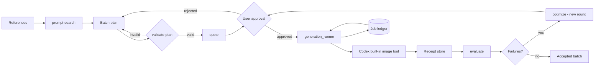

# Codex Image Factory Plugin


> Turn a reference-driven image task into an auditable production run — validated plan, approved spend, and a hash-verified receipt for every artifact.

[](https://github.com/partme-ai/codex-image-factory-plugin)
[](LICENSE)

[English](README.md) | [简体中文](README.zh-CN.md) · [Install](#installation) · [Quick start](#quick-start) · [Command contract](#command-contract) · [Troubleshooting](#troubleshooting)

## Positioning

`codex-image-factory` runs image batches through Codex itself. It validates a batch plan, asks Codex's built-in image tool to produce each item, collects every artifact with a recomputed hash, evaluates the batch against deterministic gates, and turns the failures into a new prompt round that you approve before it runs.

Version `0.1.2` is a **release candidate** with seven of its nine external gates observed — including five real generation calls, a verified multi-round evaluate/optimize/re-run loop, and a paid run driven from a fresh Codex conversation. The plugin never generates images itself, holds no API key, and never retries automatically.

### Who it is for

- Content and marketing teams producing a batch of images from references and a shared visual direction.
- Engineers who need a deterministic, resumable pipeline with receipts rather than a one-shot prompt.
- Reviewers who need to know which prompt produced which file, and what it cost.

### What problem it solves

| Problem | What this plugin provides | Verifiable entry point |
|---|---|---|
| Batches are unrepeatable | A closed plan schema with content-derived idempotency keys | `scripts/plan_validator.py` |
| Spend happens before you decide | A quote plus a required approval before any generation | `bin/image-factory quote`, `run` |
| Interrupted runs regenerate everything | A durable ledger with an explicit recovery command | `scripts/job_ledger.py`, `recover` |
| "It worked" is unverifiable | Recomputed hash, size, and dimension receipts | `scripts/receipt_store.py` |

## At a glance

```text
References + direction
      │
      ▼
┌──────────────────────────────────────────────────────────┐
│ codex-image-factory                                      │
│  ① discover   offline prompt directions                  │
│  ② plan       validated batch plan and quote             │
│  ③ approve    explicit user decision before spend        │
│  ④ run        Codex built-in image tool, one item at a time│
│  ⑤ collect    hash-verified receipt per artifact         │
│  ⑥ evaluate   deterministic gates plus an advisory score │
│  ⑦ optimize   a new prompt round you approve             │
└──────────────────────────────────────────────────────────┘
      │
      ▼
Image batch + receipts + evaluation record
```

| Property | Value |
|---|---|
| Plugin ID | `codex-image-factory` |
| Host | Codex CLI or ChatGPT desktop app |
| Current version | `0.1.2` (release candidate — see [Maturity](#maturity)) |
| Plugin manifest | `.codex-plugin/plugin.json` |
| MCP configuration | none — the manifest forbids an MCP entry until an MCP server exists |
| Primary language | Python 3.11+ |
| License | Apache-2.0 |

## Capabilities and boundaries

### Supported

| Capability | Input | Output | Limit | Status |
|---|---|---|---|---|
| Prompt discovery | A theme or reference direction | Ranked prompt templates with attribution | Offline search over bundled templates | Stable |
| Batch plan validation | A plan file | Validated plan with idempotency keys and hard caps | Rejected before anything is spent | Stable |
| Quote and approval | A validated plan | Cost estimate and an approval record | No generation without approval | Stable |
| Generation | An approved plan | One image per plan item | One tool call produces one image | Stable |
| Receipt collection | Produced files | Recomputed hash, size, and dimension per file | A second check catches a file rewritten mid-validation | Stable |
| Evaluation | A completed batch | Deterministic gate results plus an advisory score | The model-authored score is advisory only | Stable |
| Optimization | Failed items | A new prompt round requiring approval | Never overwrites the previous round | Stable |
| Recovery | An interrupted job | Reconciled ledger without re-invoking Codex | Reconciles verified receipts only | Stable |

### Not responsible for

- Generating images. Generation is performed by Codex through its own built-in image tool and your existing Codex authentication.
- Choosing the image model. The model is selected by Codex, is not selectable here, and is never hard-coded or promised by this repository. Receipts record only what Codex reports, and record `null` when Codex reports nothing.
- Controlling size, quality, background, or image count. The built-in tool accepts only a prompt and reference images, so batch items differ only by those.
- Owning a graphical workbench, project management, or video composition. Those surfaces are outside this repository.
- Providing an external generation API channel. Adding one would be a separate, clearly marked extension point; this repository does not add one and does not read API keys.

### Maturity

| Status | Meaning |
|---|---|
| Stable | Automated tests plus a deterministic gate |
| Release candidate | External gates are recorded one by one, with `NOT_RUN` where unobserved; the generation path is verified on macOS only |
| Blocked / NOT_RUN | Not verified; never present it as available |

Seven of the nine external gates for `0.1.2` are observed and recorded in [`docs/verification/runtime.md`](docs/verification/runtime.md): remote CI, tag parity, a clean Marketplace install, a no-spend smoke, five authorized generation calls, a verified multi-round evaluate/optimize/re-run loop, and a paid run driven from a fresh Codex conversation. Two stay `NOT_RUN`: the generation path has not been exercised on Linux or Windows, and the exhausted-allowance path has never been seen live — deliberately, since exhausting the image allowance is neither required nor authorized. [`docs/guides/runtime-evidence-collection.md`](docs/guides/runtime-evidence-collection.md) has the procedure for both.

## Architecture and core flow



### Component responsibilities

| Component | Owns | Does not own |
|---|---|---|
| `bin/image-factory` | CLI entry that calls `scripts/image_factory_cli.py` | Business rules |
| `scripts/image_factory_cli.py` | Subcommand dispatch and exit codes | Media handling |
| `scripts/plan_validator.py` | Plan schema, caps, idempotency keys | Prompt quality |
| `scripts/generation_runner.py` | One fresh subprocess per attempt | Retry policy |
| `scripts/job_ledger.py` | Durable state transitions and secret scrubbing | Execution |
| `scripts/receipt_store.py` | Per-artifact receipts and re-verification | Remote lifetime |
| `scripts/job_lock.py` | Cross-process advisory locking | Scheduling |
| `skills/` (4) | Routing, judging, and recovery instructions for Codex | Runtime enforcement |

## Compatibility

| Plugin version | Host | Runtime | Status |
|---|---|---|---|
| `0.1.2` | Codex CLI or ChatGPT desktop app | Python 3.11 and 3.13 in the CI matrix; Codex CLI reachable on `PATH` or through `CODEX_HOME` | Release candidate, locally verified |

CI runs on Linux, macOS, and Windows without installing any package at test time.

## Installation

### Prerequisites

- Python 3.11 or newer on `PATH`.
- The Codex CLI reachable on `PATH`, or a `CODEX_HOME` pointing at an installation.
- No API key, no npm dependency, and no external service account.

### From the plugin marketplace

```bash
codex plugin marketplace add partme-ai/codex-image-factory-plugin --ref main
codex plugin add codex-image-factory@partme-ai-image-factory
```

Restart Codex or the ChatGPT desktop app, then open a new task so the Skills load.

### From source

```bash
git clone https://github.com/partme-ai/codex-image-factory-plugin.git
cd codex-image-factory-plugin
bin/image-factory probe
```

### Confirm it loaded

```bash
codex plugin list
```

Expected entry:

```text
codex-image-factory@partme-ai-image-factory  installed, enabled
```

Then confirm the local runtime:

```bash
bin/image-factory probe
```

Expected result: a JSON capability report for Python, the Codex CLI, and ledger access, with no secret value printed.

## Quick start

### 1. Find a direction

```bash
bin/image-factory prompt-search 'storybook illustration' --limit 3 --json
```

The search is offline and attributed; it returns bundled template directions with their sources.

### 2. Write and validate a batch plan

```bash
bin/image-factory validate-plan image-plan.json
bin/image-factory quote image-plan.json
```

Validation rejects an unknown field, a cap violation, or a duplicate idempotency key before anything is spent.

### 3. Approve and run

```bash
bin/image-factory run image-plan.json --approval image-approval.json
```

Each attempt runs as a fresh subprocess against the built-in image tool. There is no retry loop, because a silent retry is how one bad prompt becomes a large bill.

### 4. Evaluate, optimize, or recover

```bash
bin/image-factory evaluate image-plan.json
bin/image-factory recover image-plan.json
bin/image-factory status image-plan.json
```

`recover` reconciles verified receipts into the ledger without re-invoking Codex, so an interrupted run resumes instead of regenerating.

## Configuration

| Setting | Where it lives | Notes |
|---|---|---|
| Codex home | `CODEX_HOME` environment variable | Defaults to the standard Codex location |
| Job ledger | The `--job` path, or `<plan>.job.json` | Plain JSON; atomic writes |
| Receipts | `<job>.receipts/` | One JSON file per artifact |
| Job lock | `<job>.lock` | Cross-process advisory lock |
| Credentials | None | The plugin stores no secret, and the ledger rejects credential-like keys |

## Command contract

| Command | Purpose | Notable flags |
|---|---|---|
| `probe` | Report Python, Codex CLI, and ledger availability | — |
| `prompt-search` | Offline, attributed prompt discovery | `--limit`, `--json` |
| `validate-plan` | Validate the closed plan schema and caps | — |
| `quote` | Estimate the batch before spending | — |
| `run` | Execute the batch against the built-in image tool | `--approval` |
| `recover` | Reconcile receipts into the ledger | — |
| `evaluate` | Run deterministic gates over the batch | — |
| `optimize` | Generate a new prompt round from failures | — |
| `status` | Read the current ledger state | — |

### Stable exit codes

| Exit | Meaning | Suggested action |
|---|---|---|
| `0` | Success | Continue |
| `1` | Failure | Read the message and fix the input |
| `2` | Usage error | Correct the command line |
| `3` | Approval required | Quote and approve the batch |
| `4` | Capability unavailable | Fix the Codex CLI availability |
| `5` | Job locked | Wait for the other process to finish |
| `6` | Recovery required | Run `recover` before continuing |

### Error categories

Recorded on the ledger entry: `capability_unavailable`, `codex_missing`, `quota_exceeded`, `timeout`, `generation_failed`, `artifact_missing`, `hash_mismatch`, `duplicate_artifact`, `plan_invalid`, `approval_required`, `job_already_running`, `recovery_required`, `unknown`.

## Retry, idempotency, and recovery

- No automatic retry anywhere. `scripts/generation_runner.py` states the reason plainly: a silent retry is how one bad prompt becomes a large bill.
- A failed item is terminal; the way forward is `optimize`, which produces a new prompt round for approval.
- Idempotency keys are content-derived per plan item, so re-running a plan does not duplicate work.
- The ledger is written atomically, and an interrupted run resumes through `recover` rather than regenerating.
- An advisory model score is recorded alongside your approve or reject labels, so the score can later be calibrated against real decisions.

## Data and state

| Data | Location | Lifecycle | Secrets |
|---|---|---|---|
| Job ledger | The `--job` path or `<plan>.job.json` | Until you delete it | None; credential-like keys are refused |
| Artifact receipts | `<job>.receipts/` | Until you delete them | None |
| Produced images | Your chosen output directory | Until you delete them | None |
| Prompt templates | Bundled in the repository | Versioned with the plugin | None |

Ledger state machine: `Draft`, `PlanValidated`, `Approved`, `Running`, `Completed`, `Partial`, `Unknown`, `Evaluated`, `PendingApproval`, `Optimized`, `Accepted`.

## Security

- No API key, token, or credential exists in this plugin; authentication is Codex's own.
- The ledger rejects credential-like keys before writing anything.
- Reference inputs are validated before use, and plan validation rejects unknown fields.
- Every hash, size, and dimension is recomputed from the file on disk, with a second check to catch a file rewritten mid-validation.
- The plugin never calls an external generation API and never updates an upstream dependency on its own.

## Development and verification

```bash
python -m unittest discover -s tests -v
python scripts/validate_distribution.py .
```

Recorded evidence:

- [Offline verification](docs/verification/offline.md) and [runtime verification](docs/verification/runtime.md) — including the `NOT_RUN` usage-limit line and the release-candidate verdict.
- [Upstream snapshot verification](docs/verification/upstream-snapshots.md) — vendored Skill snapshots are checksummed.
- [Prompt reference integration](docs/prompt-library.md) — bundled templates, case indexes, and source attribution.
- [Use cases](docs/use-cases/README.zh-CN.md) — a six-part Chinese case library.

## Troubleshooting

| Symptom | Check first | Resolution |
|---|---|---|
| `probe` reports the Codex CLI missing | `PATH` or `CODEX_HOME` | Point `CODEX_HOME` at the installation or fix `PATH` |
| Plan validation fails | The plan schema | Fix the named field; unknown fields are rejected on purpose |
| The run refuses to start | The approval file | Quote the plan and approve the new revision |
| A run stops mid-batch | Ledger state | Run `recover`; verified receipts are reconciled, not regenerated |
| Hash verification fails | The artifact on disk | Treat it as a hard failure; the file changed after generation |
| A model name was expected in receipts | Platform boundary | The model is chosen by Codex; receipts record only what Codex reports |

## Project structure

```text
codex-image-factory-plugin/
├── .codex-plugin/plugin.json   # identity and presentation metadata
├── .agents/plugins/marketplace.json
├── bin/image-factory           # CLI entry point
├── scripts/                    # CLI, validator, runner, ledger, receipts, locks
├── skills/                     # 4 Skills: use, run, judge, recover
├── tests/                      # offline gates and distribution contracts
├── vendor/upstream/            # pinned upstream Skill snapshots
└── docs/                       # architecture, technical solution, verification, use cases
```

## Deep links

- [Architecture](docs/Codex-Image-Factory-Plugin-Architecture.md) · [架构文档](docs/Codex-Image-Factory-Plugin-Architecture.zh_CN.md)
- [Technical solution](docs/Codex-Image-Factory-Plugin-Technical-Solution.md) · [技术方案](docs/Codex-Image-Factory-Plugin-Technical-Solution.zh_CN.md)
- [Design specification](docs/superpowers/specs/2026-09-12-codex-image-factory-plugin-design.md)
- [Production hardening design](docs/superpowers/specs/2026-09-14-codex-image-factory-production-hardening-design.md)
- [Implementation plan](docs/superpowers/plans/2026-09-12-codex-image-factory-plugin-implementation.md)

## Contributing and support

Open functional issues at <https://github.com/partme-ai/codex-image-factory-plugin/issues>. Before proposing a change, state the Python version you verified on, whether it alters the plan schema or the ledger format, and include the affected gates.

## License

Apache-2.0 — see [LICENSE](LICENSE).
