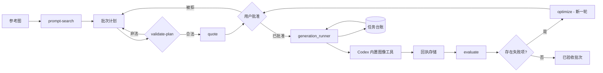

# Image Factory 插件


> 把"给定参考做一批图"变成一次可审计的生产运行——校验计划、批准花费，每件产物都有可核验回执。

[](https://github.com/full-aigc-plugins/image-factory-plugin/releases/tag/v0.1.5)
[](LICENSE)

[English](README.md) | [简体中文](README.zh-CN.md) · [安装](#安装) · [快速开始](#快速开始) · [命令契约](#命令契约) · [故障排查](#故障排查)

## 项目定位

`image-factory` 通过 Codex 本身来跑批量图片：先校验批次计划，再由 Codex 内置图像工具逐项生成，采集每件产物并独立重算哈希，用确定性门禁评测，最后把失败项改写成新一轮 prompt，经你批准后才执行。

版本 `0.1.5` 是供应链加固候选，付费生成行为与 `0.1.2` 保持一致。已观测的七项外部门禁和五次授权出图仍属于 `0.1.2` 历史证据，需在完成 `0.1.5` 全新安装与远端发布核验后补充当前证据。插件自身不出图、不持有任何 API Key，也绝不自动重试。

### 适合谁

- 需要按统一视觉方向、基于参考图批量出图的内容与市场团队。
- 需要确定性、可恢复、带回执的流水线，而不是一次性 prompt 的工程师。
- 需要知道"哪条 prompt 产出了哪个文件、花了多少"的审阅者。

### 解决什么问题

| 问题 | 本插件提供 | 可验证入口 |
|---|---|---|
| 批次无法复现 | 封闭的计划 schema 与按内容派生的幂等键 | `scripts/plan_validator.py` |
| 还没决定就先花了钱 | 先报价，再要求批准，然后才生成 | `bin/image-factory quote`、`run` |
| 中断后全部重做 | 可持久台账与显式恢复命令 | `scripts/job_ledger.py`、`recover` |
| "跑通了"无法核实 | 重算的哈希、大小与尺寸回执 | `scripts/receipt_store.py` |

## 一眼看懂

```text
参考图 + 视觉方向
      │
      ▼
┌──────────────────────────────────────────────────────────┐
│ image-factory                                      │
│  ① discover   离线检索 prompt 方向                       │
│  ② plan       校验批次计划并报价                          │
│  ③ approve    花费前由你明确批准                         │
│  ④ run        由 Codex 内置图像工具逐项生成              │
│  ⑤ collect    为每件产物生成哈希校验回执                 │
│  ⑥ evaluate   确定性门禁 + 参考性评分                    │
│  ⑦ optimize   生成新一轮 prompt，等你批准                │
└──────────────────────────────────────────────────────────┘
      │
      ▼
图片批次 + 回执 + 评测记录
```

| 项目属性 | 值 |
|---|---|
| 插件 ID | `image-factory` |
| 宿主 | Codex CLI 或 ChatGPT 桌面应用 |
| 当前版本 | `0.1.5`（供应链 release candidate，详见[成熟度](#成熟度)） |
| 插件清单 | `.codex-plugin/plugin.json` |
| MCP 配置 | 无——在 MCP 服务器存在之前，清单一律禁止写 MCP 条目 |
| 主要语言 | Python 3.11+ |
| 许可证 | Apache-2.0 |

## 能力与边界

### 已支持

| 能力 | 输入 | 输出 | 限制 | 状态 |
|---|---|---|---|---|
| prompt 检索 | 主题或参考方向 | 带来源的 prompt 模板排序 | 对内置模板做离线检索 | 稳定 |
| 批次计划校验 | 一个计划文件 | 含幂等键与硬上限的已校验计划 | 花费之前即被拒绝 | 稳定 |
| 报价与批准 | 已校验的计划 | 成本估算与批准记录 | 无批准不生成 | 稳定 |
| 生成 | 已批准的计划 | 每个计划项一张图 | 一次工具调用产出一张图 | 稳定 |
| 回执采集 | 产出的文件 | 逐文件重算的哈希、大小与尺寸 | 二次校验可发现验证窗口内被改写的文件 | 稳定 |
| 评测 | 已完成的批次 | 确定性门禁结果 + 参考性评分 | 模型给出的评分仅供参考 | 稳定 |
| 优化 | 失败项 | 需要批准的新一轮 prompt | 绝不覆盖上一轮 | 稳定 |
| 恢复 | 中断的任务 | 不重新调用 Codex 的台账核对 | 只核对已核验的回执 | 稳定 |

### 不负责

- 生成图片。生成由 Codex 通过其内置图像工具、使用你已有的 Codex 认证完成。
- 选择图像模型。模型由 Codex 决定，此处不可选择，本仓库也绝不硬编码或承诺任何模型名。回执只记录 Codex 告知的内容，未告知时记为 `null`。
- 控制尺寸、质量、背景或张数。内置工具只接受 prompt 与参考图，因此批次项的差异只能来自这两者。
- 拥有图形工作台、项目管理或视频合成。这些界面不在本仓库范围内。
- 提供外部生成 API 通道。若日后需要，那是需要独立标注的扩展点；本仓库不新增，也不读取 API Key。

### 成熟度

| 状态 | 含义 |
|---|---|
| 稳定 | 有自动化测试与确定性门禁 |
| release candidate | 外部门禁逐条记录，未观测的标为 `NOT_RUN`；生成路径目前仅在 macOS 上验证 |
| 封锁 / NOT_RUN | 未验证；不得描述为可用 |

`0.1.2` 的九项外部门禁中已有七项观测通过，逐条记录在 [`docs/verification/runtime.md`](docs/verification/runtime.md)：远程 CI、标签一致性、Marketplace 全新安装、无花费冒烟、五次已授权的真实出图、一次已验证的多轮「评测→优化→重跑」闭环，以及一次从全新 Codex 会话驱动的付费运行。仍为 `NOT_RUN` 的有两项：生成路径未在 Linux 或 Windows 上执行过，以及额度耗尽路径从未被实际观测——后者是刻意的，因为故意耗尽出图额度既无必要也未被授权。两项的采集步骤见 [`docs/guides/runtime-evidence-collection.md`](docs/guides/runtime-evidence-collection.md)。

## 架构与核心流程



### 组件职责

| 组件 | 负责 | 不负责 |
|---|---|---|
| `bin/image-factory` | 调用 `scripts/image_factory_cli.py` 的 CLI 入口 | 业务规则 |
| `scripts/image_factory_cli.py` | 子命令分发与退出码 | 媒体处理 |
| `scripts/plan_validator.py` | 计划 schema、上限与幂等键 | prompt 质量 |
| `scripts/generation_runner.py` | 每次尝试都是一个全新子进程 | 重试策略 |
| `scripts/job_ledger.py` | 持久状态迁移与密钥清洗 | 执行 |
| `scripts/receipt_store.py` | 逐产物回执与复核 | 远端生命周期 |
| `scripts/job_lock.py` | 跨进程建议锁 | 调度 |
| `skills/`（4 个） | 供 Codex 使用的路由、评判与恢复指令 | 运行时强制 |

## 兼容性

| 插件版本 | 宿主 | 运行环境 | 状态 |
|---|---|---|---|
| `0.1.2` | Codex CLI 或 ChatGPT 桌面应用 | CI 矩阵覆盖 Python 3.11 与 3.13；Codex CLI 需在 `PATH` 上或通过 `CODEX_HOME` 可达 | release candidate；生成路径已在 macOS 验证 |

CI 在 Linux、macOS 与 Windows 上运行，且测试期不安装任何依赖包。

## 安装

### 前置条件

- `PATH` 上有 Python 3.11 或更新版本。
- Codex CLI 在 `PATH` 上可达，或用 `CODEX_HOME` 指向其安装位置。
- 不需要 API Key、不需要 npm 依赖、也不需要任何外部服务账号。

### 从插件市场安装

```bash
codex plugin marketplace add full-aigc-plugins/image-factory-plugin --ref v0.1.5
codex plugin add image-factory@partme-ai-image-factory
```

重启 Codex 或 ChatGPT 桌面应用，然后新建任务以加载 Skills。

### 从源码安装

```bash
git clone https://github.com/full-aigc-plugins/image-factory-plugin.git
cd image-factory-plugin
bin/image-factory probe
```

### 确认加载成功

```bash
codex plugin list
```

预期条目：

```text
image-factory@partme-ai-image-factory  installed, enabled
```

再确认本地运行环境：

```bash
bin/image-factory probe
```

预期结果：一份 JSON 能力报告，覆盖 Python、Codex CLI 与台账访问，且不打印任何秘密值。

### 国内镜像（AtomGit）

如果 GitHub 访问缓慢或不可达，可改用 AtomGit 镜像安装。命令完全一致，只把市场地址换成镜像：

```bash
codex plugin marketplace add https://atomgit.com/partme-ai/partme-image-factory.git --ref main
codex plugin add image-factory@partme-ai-image-factory
```

如需一步安装 partme-ai 全部插件目录：

```bash
codex plugin marketplace add https://atomgit.com/partme-ai/plugins.git
codex plugin add image-factory@partme-ai-image-factory
```

注意事项：

- AtomGit 源与 GitHub 源共用市场名，后添加的会覆盖先添加的。切回官方源执行
  `codex plugin marketplace add https://github.com/partme-ai/plugins.git`。
- ZCode 与 Kimi 用户可先将镜像仓库克隆到本地，再在各平台的 marketplace 配置中登记本地目录。

## 快速开始

### 1. 先找方向

```bash
bin/image-factory prompt-search '绘本插画' --limit 3 --json
```

检索是离线的、带来源标注的：返回内置模板方向及其出处。

### 2. 写并校验批次计划

```bash
bin/image-factory validate-plan image-plan.json
bin/image-factory quote image-plan.json
```

校验会在花费之前拒绝未知字段、超限与重复幂等键。

### 3. 批准并运行

```bash
bin/image-factory run image-plan.json --approval image-approval.json
```

每次尝试都是一个针对内置图像工具的全新子进程。这里没有重试循环——源码里写得很直白：静默重试就是"一个坏 prompt 变成一张大账单"的成因。

### 4. 评测、优化或恢复

```bash
bin/image-factory evaluate image-plan.json
bin/image-factory recover image-plan.json
bin/image-factory status image-plan.json
```

`recover` 会把已核验的回执核对进台账，且不会重新调用 Codex，因此中断的运行是恢复而不是重做。

## 配置

| 设置 | 所在位置 | 说明 |
|---|---|---|
| Codex 主目录 | `CODEX_HOME` 环境变量 | 默认为 Codex 的标准位置 |
| 任务台账 | `--job` 指定路径，或 `<plan>.job.json` | 纯 JSON，原子写入 |
| 回执 | `<job>.receipts/` | 每件产物一个 JSON 文件 |
| 任务锁 | `<job>.lock` | 跨进程建议锁 |
| 凭据 | 无 | 插件不保存秘密，台账也会拒绝形似凭据的键 |

## 命令契约

| 命令 | 用途 | 主要参数 |
|---|---|---|
| `probe` | 报告 Python、Codex CLI 与台账可用性 | — |
| `prompt-search` | 离线且带来源的 prompt 检索 | `--limit`、`--json` |
| `validate-plan` | 校验封闭的计划 schema 与上限 | — |
| `quote` | 花费前估算批次成本 | — |
| `run` | 针对内置图像工具执行批次 | `--approval` |
| `recover` | 把回执核对进台账 | — |
| `evaluate` | 对批次运行确定性门禁 | — |
| `optimize` | 依据失败项生成新一轮 prompt | — |
| `status` | 读取当前台账状态 | — |

### 稳定退出码

| 退出码 | 含义 | 建议动作 |
|---|---|---|
| `0` | 成功 | 继续 |
| `1` | 失败 | 阅读消息并修正输入 |
| `2` | 用法错误 | 修正命令行 |
| `3` | 需要批准 | 报价并批准该批次 |
| `4` | 能力不可用 | 修复 Codex CLI 的可用性 |
| `5` | 任务被锁定 | 等待另一个进程结束 |
| `6` | 需要恢复 | 先执行 `recover` 再继续 |

### 错误类别

记录在台账条目上：`capability_unavailable`、`codex_missing`、`quota_exceeded`、`timeout`、`generation_failed`、`artifact_missing`、`hash_mismatch`、`duplicate_artifact`、`plan_invalid`、`approval_required`、`job_already_running`、`recovery_required`、`unknown`。

## 重试、幂等与恢复

- 任何环节都不做自动重试。`scripts/generation_runner.py` 把理由写得很明确：静默重试就是"一个坏 prompt 变成一张大账单"的成因。
- 失败项是终态；正确的下一步是 `optimize`，它会产出一轮等待批准的新 prompt。
- 幂等键按计划项内容派生，因此重跑计划不会产生重复工作。
- 台账原子写入，中断的运行通过 `recover` 续跑，而不是重新生成。
- 模型给出的参考性评分会与你的批准/驳回标注一起记录，便于日后用真实决策校准该评分。

## 数据与状态

| 数据 | 位置 | 生命周期 | 是否含秘密 |
|---|---|---|---|
| 任务台账 | `--job` 指定路径或 `<plan>.job.json` | 直到你删除 | 否；形似凭据的键会被拒绝 |
| 产物回执 | `<job>.receipts/` | 直到你删除 | 否 |
| 产出的图片 | 你选择的输出目录 | 直到你删除 | 否 |
| prompt 模板 | 内置于仓库 | 随插件版本化 | 否 |

台账状态机：`Draft`、`PlanValidated`、`Approved`、`Running`、`Completed`、`Partial`、`Unknown`、`Evaluated`、`PendingApproval`、`Optimized`、`Accepted`。

## 安全

- 本插件不含任何 API Key、Token 或凭据；认证使用的是 Codex 自身的。
- 台账在写入任何内容之前会拒绝形似凭据的键。
- 参考输入在使用前会先校验，计划校验会拒绝未知字段。
- 每个哈希、大小与尺寸都从磁盘文件重算，并有二次校验以发现验证窗口内被改写的文件。
- 插件绝不调用外部生成 API，也绝不自行升级上游依赖。

## 开发与验证

```bash
python -m unittest discover -s tests -v
python scripts/validate_distribution.py .
```

仓库中已记录的证据：

- [离线验证](docs/verification/offline.md) 与 [运行期验证](docs/verification/runtime.md)——逐条记录外部门禁的 `PASS`／`NOT_RUN` 状态。
- [上游快照验证](docs/verification/upstream-snapshots.md)——内置 Skill 快照均有校验和。
- [提示词参考层](docs/prompt-library.md)——内置模板、案例索引与来源标注。
- [使用案例](docs/use-cases/README.zh-CN.md)——六类中文案例库。

## 故障排查

| 现象 | 优先检查 | 处理方式 |
|---|---|---|
| `probe` 报告 Codex CLI 缺失 | `PATH` 或 `CODEX_HOME` | 用 `CODEX_HOME` 指向安装位置，或修正 `PATH` |
| 计划校验失败 | 计划 schema | 修正被点名的字段；未知字段是有意拒绝的 |
| 运行拒绝启动 | 批准文件 | 对该计划报价并批准新的 revision |
| 批次中途停止 | 台账状态 | 执行 `recover`；已核验的回执会被核对而不是重做 |
| 哈希校验失败 | 磁盘上的产物 | 视为硬失败；文件在生成之后被改动过 |
| 期望回执里出现模型名 | 平台边界 | 模型由 Codex 决定；回执只记录 Codex 告知的内容 |

## 项目结构

```text
image-factory-plugin/
├── .codex-plugin/plugin.json   # 身份与展示元数据
├── .agents/plugins/marketplace.json
├── bin/image-factory           # CLI 入口
├── scripts/                    # CLI、校验器、运行器、台账、回执、锁
├── skills/                     # 4 个 Skill：use、run、judge、recover
├── tests/                      # 离线门禁与分发契约
├── vendor/upstream/            # 固定的上游 Skill 快照
└── docs/                       # 架构、技术方案、验证记录、使用案例
```

## 深入文档

- [Architecture](docs/Image-Factory-Plugin-Architecture.md) · [架构文档](docs/Image-Factory-Plugin-Architecture.zh_CN.md)
- [Technical solution](docs/Image-Factory-Plugin-Technical-Solution.md) · [技术方案](docs/Image-Factory-Plugin-Technical-Solution.zh_CN.md)
- [设计规格](docs/superpowers/specs/2026-09-12-image-factory-plugin-design.md)
- [生产加固设计](docs/superpowers/specs/2026-09-14-image-factory-production-hardening-design.md)
- [实施计划](docs/superpowers/plans/2026-09-12-image-factory-plugin-implementation.md)

## 贡献与支持

功能问题请提交到 <https://github.com/full-aigc-plugins/image-factory-plugin/issues>。提交变更前，请说明你验证所用的 Python 版本、是否改动计划 schema 或台账格式，并附上受影响的门禁。

## 许可证

Apache-2.0，见 [LICENSE](LICENSE)。
