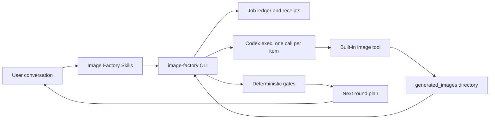
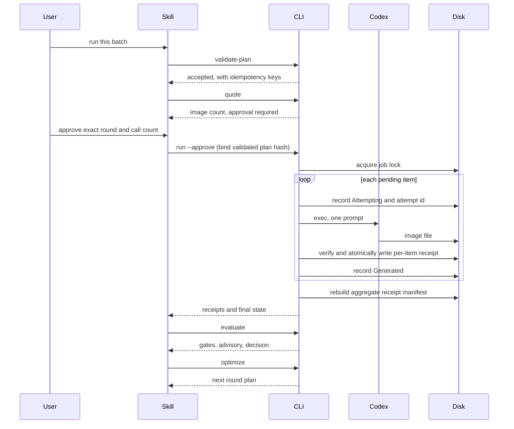

# Codex Image Factory Plugin Architecture

> **Document control**
>
> | Field | Value |
> |---|---|
> | Status | 0.1.2 release candidate; 7 of 9 external gates observed, generation path verified on macOS |
> | Scope | The implemented batch image core and prompt-discovery layer |
> | Audience | Maintainers, reviewers, and integrators of this plugin |
> | Out of scope | Workbench UI, parent project state, and non-image media pipelines |
> | Runtime evidence | `docs/verification/` |
> | Last structural revision | 2026-09-14 |

[English](Codex-Image-Factory-Plugin-Architecture.md) | [简体中文](Codex-Image-Factory-Plugin-Architecture.zh_CN.md)

## 1. Executive summary

Producing a set of images that share a look is repetitive manual work: read a reference, guess a prompt, generate, compare, adjust, generate again, and finally save something that works. The work is repeated for every subject and every variation, and the result is usually a prompt pasted into a chat window that nobody can reproduce later.

This plugin turns that into a batch that can be re-run, audited, and resumed. The plugin never generates images itself: Codex performs generation through its own built-in image tool, and this repository owns the plan, the spend gate, the receipts, the evaluation, and the recovery.

## 2. Drivers and constraints

Its drivers, in order:

1. **A result must be reproducible.** A batch is a document, a run is recorded, and every artifact carries a receipt whose hash is recomputed from the file.
2. **Spending must be deliberate.** Quoting is free, running is not, and an interrupted batch resumes rather than repeats.
3. **Judgement must stay honest.** Machine checks decide what can be decided mechanically; a model's opinion is recorded as a signal, and a person's decision outranks both.

| Driver | Consequence for the architecture |
|---|---|
| Reproducibility | A closed plan schema with content-derived idempotency keys |
| Deliberate spend | A free quote step and an approval bound to the validated plan hash |
| Honest judgement | Deterministic gates decide; advisory scores are recorded beside human labels |
| Auditability | One atomically written, schema-valid, hash-verifying receipt per item |

### Non-goals

Generating a single image on request, editing image content in place, and hosting a service. The plugin is local, and it does not generate images itself.

## 3. Context and trust boundary

The Codex conversation is the product surface. Skills present direction choices, a compact creation confirmation card, the exact call count, numbered results, and the next decision. Plans, idempotency keys, receipts, and paths remain on disk for audit instead of becoming a form the user has to operate.

The trust boundary is worth stating plainly. The plugin trusts Codex to perform generation and to report what it did, but it does not trust Codex's report as evidence: a step is complete only when a new file appears in the generation directory and its hash, size, and dimensions are recomputed from disk. The plugin never reads, copies, or stores authentication material; Codex handles its own credentials.

## 4. Current state, target state, and gaps

| Capability | Current | Target | Gap |
|---|---|---|---|
| Prompt discovery | Implemented offline with attribution | Unchanged | None |
| Batch plan validation and spend caps | Implemented | Unchanged | None |
| Approval gate | Implemented, bound to the validated plan hash | Unchanged | None |
| Receipt collection and verification | Implemented, with a second check after publication | Unchanged | None |
| Evaluation | Deterministic gates plus advisory and human labels | Unchanged | None |
| Recovery | Implemented; reconciles receipts without re-invoking Codex | Unchanged | None |
| Explicit size, quality, or model control | Not available by platform design | Unchanged | Out of scope rather than planned |
| Usage-limit evidence | `NOT_RUN`; exhausting the allowance is neither required nor authorized | Unchanged | Deliberately unexercised |
| Remote CI, source/remote/tag parity, fresh marketplace install, paid canary | Not run | Verified | External release gates |

## 5. Principles and decisions

| Decision | Rationale | Reversal condition |
|---|---|---|
| A receipt is the source of truth, not a claim | A generator can exit zero and still produce nothing usable | None |
| No retry loop anywhere | The source states it plainly: a silent retry is how one bad prompt becomes a large bill | None |
| Reject credential-like ledger keys instead of scrubbing them | A ledger must always be safe to share as evidence | None |
| Refuse to start without an explicit approval | The spend gate is a product property, not a convenience | None |
| Record an advisory score without trusting it | A model's opinion is a signal to calibrate, not a verdict | Once human labels make calibration measurable |
| Keep the schema narrower than the tool | Accepting an unsupported field would be a promise the platform cannot keep | If the platform adds explicit parameter control |

## 6. Components and dependencies

| Component | Owns | Does not own |
| --- | --- | --- |
| `scripts/capability_probe.py` | Reading the local environment to decide whether a batch can run | Installing or repairing anything |
| `scripts/schema_lite.py` | Enforcing the published JSON Schemas | Defining contracts the schema does not state |
| `scripts/plan_validator.py` | Batch plan validation, idempotency keys, spend caps | Generating anything |
| `scripts/prompt_library.py` | Offline attributed template and category discovery | Calling a generator or executing upstream Skills |
| `scripts/generation_runner.py` | One Codex invocation per item and failure classification | Retrying, and writing prompts |
| `scripts/artifact_collector.py` | Locating, verifying, and publishing artifacts; receipts | Deciding whether a result is good |
| `scripts/job_ledger.py` | Durable job state, atomic writes, secret refusal | Spending decisions |
| `scripts/evaluator.py` | Deterministic gates, advisory recording, human labels | Calling a model |
| `scripts/optimizer.py` | Which items to redo, and the next round document | Writing the rewrites |
| `scripts/image_factory_cli.py` | The spend gate and the subcommands Skills call | Any of the above logic |
| `skills/*` | Deciding which command to run and reporting the outcome | Deterministic state |

## 7. Runtime and core flow

Failure, cancellation, and timeout semantics:

- A **timeout or interrupted subprocess after reservation** is ambiguous. The item becomes `Unknown` unless a valid per-item receipt proves completion; it is never retried automatically.
- A **usage limit** stops the whole batch. The limit id and reset time are recorded, and no further item is attempted in that run.
- A **missing artifact** after an exit code of zero is a failure, not a success. The generator's claim and the disk's evidence are different things.
- **Cancellation** preserves the durable `Attempting` evidence. Recovery either verifies its receipt or changes it to `Unknown`; it never turns it back into pending work.

## 8. Contracts, state, and data

Four documents form the interface, each closed with `additionalProperties: false`.

**`schemas/image_batch.schema.json`** — one batch round. Requires `schema_version`, `batch_id`, `round`, and `items`. An item carries an `id`, a `prompt`, and at most five `reference_images`. The schema deliberately has no `size`, `quality`, `background`, `n`, or `model` field: the built-in tool accepts none of them, so accepting them here would be a promise the platform cannot keep.

**`schemas/artifact_receipt.schema.json`** — one collected artifact. Carries the path, `sha256`, `bytes`, `width`, `height`, `prompt_sha256`, and `idempotency_key`, plus a `source` block naming the generation session and call. `source.model_reported` is nullable and is `null` in practice: the plugin records what Codex reported and never infers a model.

**`schemas/factory_job.schema.json`** — the 1.1.0 ledger. Governs the state machine, approval history, plan-hash binding, and the `Attempting`/`Unknown` item lifecycle. Legacy 1.0.0 documents migrate in memory without inventing approval evidence or changing observed outcomes.

**`schemas/scores.schema.json`** — one evaluation. Separates `deterministic_gates` from `advisory` and `human_labels`, and ends in a `decision` of `pass`, `fail`, or `pending_approval`.

| Data | Owner | Location | Consistency |
|---|---|---|---|
| Job ledger | The CLI | The `--job` path, or `<plan>.job.json` | Atomic write through a temporary file, `fsync`, and `os.replace` |
| Per-item receipts | The collector | `<job>.receipts/` | One atomically written, schema-valid, hash-verifying file per item |
| Aggregate manifest | The CLI | Alongside the ledger | A projection only; rebuildable during recovery |
| Produced images | Codex's image tool | `$CODEX_HOME/generated_images` | Verified from disk, never from a claim |

## 9. Platform boundaries

Measured properties of the Codex image tool, not preferences. The plugin is built around them, and they are documented rather than worked around:

- The image model is selected by Codex. This repository hardcodes no model name, promises none, and records only what a run reports.
- The tool accepts a prompt and reference images. Size, quality, background, and image count are fixed, so batch items differ only by prompt and reference images.
- One call produces one image, and an edit accepts at most five reference images.
- Generation consumes the account's image allowance. The plugin estimates the batch, requires approval, and never retries.

A plugin-owned API channel would be a separate extension point with its own credentials. This repository adds none and reads no API keys.

## 10. Security and reliability budgets

- **No generation control by default.** `run` refuses to start a plan that asks for approval unless `--approve` is given.
- **No approval bypass.** The plugin never passes `--dangerously-bypass-approvals-and-sandbox` or `--dangerously-bypass-hook-trust`; the user's approval posture stays in force. Tests assert these flags never appear in an invocation.
- **No silent retry.** There is no retry loop anywhere. A failed item is recorded and reported.
- **One cross-process writer.** A job-path-derived OS lock covers approval, reservation, invocation, receipt persistence, and final transition. A second writer fails with `job_already_running` before it can invoke Codex.
- **Receipts are authoritative.** One atomically written, schema-valid, hash-verifying receipt per item is the source of truth. The aggregate manifest is only a projection and can be rebuilt during recovery.
- **Human labels are mandatory when configured.** Deterministic success and advisory assessment cannot produce `pass` while a required label is missing.
- **Secrets are refused, not scrubbed.** The ledger rejects credential-like keys on both read and write, so a ledger is always safe to share as evidence.
- **Atomic writes.** Ledger writes go through a temporary file, `fsync`, and `os.replace`, so a reader sees the previous or the next state, never a torn one.
- **Independent verification.** Hashes and dimensions are recomputed, and a second check after publication catches a file rewritten mid-validation.
- **Repeated content is reported, not hidden.** Identical images across two items are flagged for every participant, because which item "should" own the content cannot be decided from the files.
- **No shell.** Invocations are argv arrays with `shell=False`.

| Budget | Value | Rationale |
|---|---|---|
| Calls per item per run | One | A second call is a new decision, not a retry |
| Approval binding | Validated plan hash | An approval must not authorize a modified plan |
| Concurrent writers | One | A second writer could double-spend |
| Stop rule | Any failed item is terminal for that item | Only `optimize` produces the next round |
| Missing usage-limit evidence | `NOT_RUN` | Deliberately exhausting the allowance is neither required nor authorized |

## 11. Deployment, compatibility, and evolution

The plugin is a Codex plugin with a compatibility manifest at `.codex-plugin/plugin.json` and a URL marketplace entry. There is no MCP server, no daemon, and no network listener; the portable root `plugin.json` and `mcp.json` stay intentionally inactive, as `docs/portable-migration.md` records.

Runtime prerequisites: a Codex installation the user already has, a signed-in account whose plan includes image generation, and a writable `$CODEX_HOME/generated_images` directory. `bin/image-factory probe` reports which of these is missing and what to do about it, without network access and without executing anything.

Python 3.11 or later is required for `tomllib`. All scripts use the standard library only. GitHub Actions defines six offline cells: Linux, macOS, and Windows on Python 3.11 and 3.13. Each cell compiles sources, runs the full suite, validates the distribution, and checks the diff without installing runtime dependencies.

This document describes the implemented 0.1.2 release candidate image core and prompt-discovery layer. Workbench UI, parent project state, and non-image media pipelines are separate product responsibilities and are not implemented or planned in this plugin repository.

The design leaves three clean seams:

- **Another generation channel.** `generation_runner` is the only module that talks to a generator. A second channel with explicit parameter control would be a new adapter behind the same ledger and receipts.
- **Calibrated advisory scores.** Human labels are already recorded next to advisory scores in every `scores.json`. Once enough exist, the advisory signal can be measured against real decisions rather than trusted.
- **Image-specific derived artifacts.** Recipes, fixtures, receipts, and scoring remain shaped around images; non-image media belongs to its owning product.

| Risk | Mitigation |
|---|---|
| A generator reports success without producing a file | The artifact, not the exit code, is the evidence |
| An interrupted run repeats spend | The ledger resumes by reconciling verified receipts |
| A model opinion becomes the verdict | Deterministic gates decide; the score is advisory |
| Credentials leak into shared evidence | The ledger refuses credential-like keys on read and write |

## 12. Evidence map

| Claim | Evidence |
|---|---|
| Plan schema and caps | `schemas/image_batch.schema.json`, `scripts/plan_validator.py` |
| Spend gate | `scripts/image_factory_cli.py` and the approval tests |
| Receipt verification | `scripts/artifact_collector.py` and its tests |
| Ledger and secret refusal | `scripts/job_ledger.py` and its tests |
| Recovery without regeneration | `scripts/image_factory_cli.py` `recover`, `docs/verification/runtime.md` |
| External gate status | `docs/verification/runtime.md`, `docs/verification/offline.md` |
