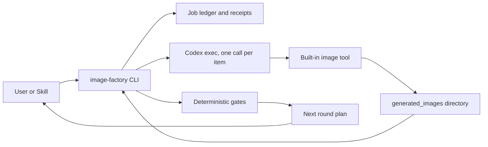
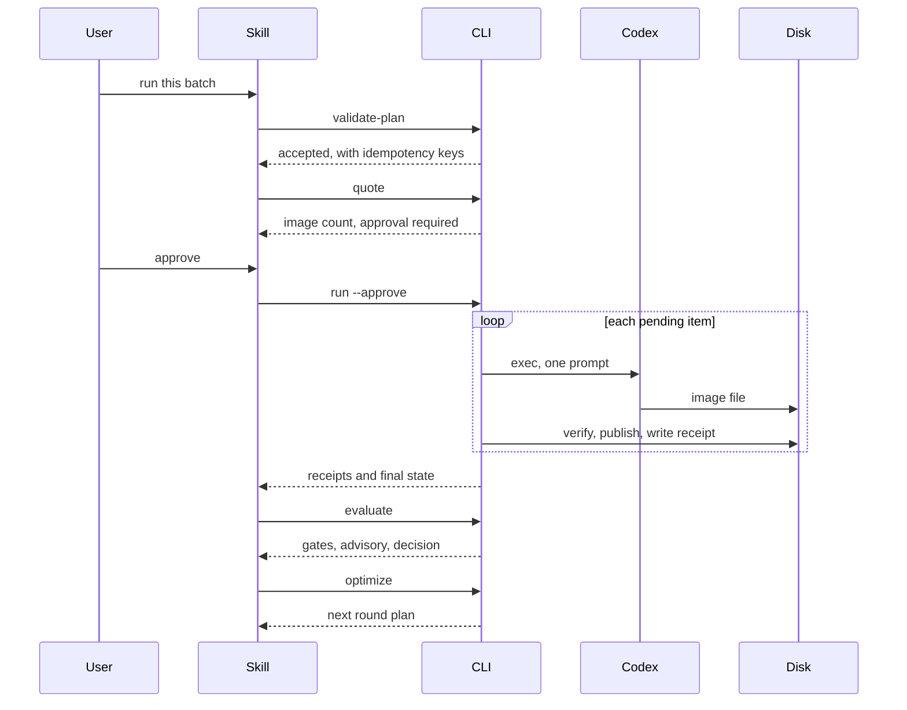

# Codex Image Factory Plugin Architecture

> **Status:** image core implemented and runtime-verified; prompt discovery implemented and offline-verified. **Version:** 0.1.1. **Updated:** 2026-09-13.

[English](Codex-Image-Factory-Plugin-Architecture.md) | [简体中文](Codex-Image-Factory-Plugin-Architecture.zh_CN.md)

## 1. Drivers and scope

Producing a set of images that share a look is repetitive manual work: read a
reference, guess a prompt, generate, compare, adjust, generate again, and finally
save something that works. The work is repeated for every subject and every
variation, and the result is usually a prompt pasted into a chat window that
nobody can reproduce later.

This plugin turns that into a batch that can be re-run, audited, and resumed. Its
drivers, in order:

1. **A result must be reproducible.** A batch is a document, a run is recorded,
   and every artifact carries a receipt whose hash is recomputed from the file.
2. **Spending must be deliberate.** Quoting is free, running is not, and an
   interrupted batch resumes rather than repeats.
3. **Judgement must stay honest.** Machine checks decide what can be decided
   mechanically; a model's opinion is recorded as a signal, and a person's
   decision outranks both.

Out of scope: generating a single image on request, editing image content in
place, and hosting a service. The plugin is local, and it does not generate
images itself.

## 2. Context

The trust boundary is worth stating plainly. The plugin trusts Codex to perform
generation and to report what it did, but it does not trust Codex's report as
evidence: a step is complete only when a new file appears in the generation
directory and its hash, size, and dimensions are recomputed from disk. The
plugin never reads, copies, or stores authentication material; Codex handles its
own credentials.

## 3. Components

| Component | Owns | Does not own |
| --- | --- | --- |
| `scripts/capability_probe.py` | Reading the local environment to decide whether a batch can run | Installing or repairing anything |
| `scripts/schema_lite.py` | Enforcing the published JSON Schemas | Defining contracts the schema does not state |
| `scripts/plan_validator.py` | Batch plan validation, idempotency keys, spend caps | Generating anything |
| `scripts/prompt_library.py` | Offline attributed template and category discovery | Calling a generator or executing upstream Skills |
| `scripts/generation_runner.py` | One Codex invocation per item and failure classification | Retrying, and writing prompts |
| `scripts/artifact_collector.py` | Locating, verifying, and publishing artifacts; receipts | Deciding whether a result is good |
| `scripts/job_ledger.py` | Durable job state, atomic writes, secret refusal | Spending decisions |
| `scripts/evaluator.py` | Deterministic gates, advisory recording, human labels | Calling a model |
| `scripts/optimizer.py` | Which items to redo, and the next round document | Writing the rewrites |
| `scripts/image_factory_cli.py` | The spend gate and the subcommands Skills call | Any of the above logic |
| `skills/*` | Deciding which command to run and reporting the outcome | Deterministic state |

## 4. Core flow

Failure, cancellation, and timeout semantics:

- A **timeout** ends that item only. It is classified as `timeout` and is not
  retried; the batch continues with the remaining items.
- A **usage limit** stops the whole batch. The limit id and reset time are
  recorded, and no further item is attempted in that run.
- A **missing artifact** after an exit code of zero is a failure, not a success.
  The generator's claim and the disk's evidence are different things.
- **Cancellation** leaves the ledger at `Running` with the completed items
  recorded. The next run skips them.

## 5. Contracts

Four documents form the interface, each closed with `additionalProperties: false`.

**`schemas/image_batch.schema.json`** — one batch round. Requires
`schema_version`, `batch_id`, `round`, and `items`. An item carries an `id`, a
`prompt`, and at most five `reference_images`. The schema deliberately has no
`size`, `quality`, `background`, `n`, or `model` field: the built-in tool accepts
none of them, so accepting them here would be a promise the platform cannot keep.

**`schemas/artifact_receipt.schema.json`** — one collected artifact. Carries the
path, `sha256`, `bytes`, `width`, `height`, `prompt_sha256`, and
`idempotency_key`, plus a `source` block naming the generation session and call.
`source.model_reported` is nullable and is `null` in practice: the plugin records
what Codex reported and never infers a model.

**`schemas/factory_job.schema.json`** — the ledger. Governs the state machine,
per-item states, and the closed set of failure categories.

**`schemas/scores.schema.json`** — one evaluation. Separates
`deterministic_gates` from `advisory` and `human_labels`, and ends in a
`decision` of `pass`, `fail`, or `pending_approval`.

## 6. Platform boundaries

Measured properties of the Codex image tool, not preferences. The plugin is built
around them, and they are documented rather than worked around:

- The image model is selected by Codex. This repository hardcodes no model name,
  promises none, and records only what a run reports.
- The tool accepts a prompt and reference images. Size, quality, background, and
  image count are fixed, so batch items differ only by prompt and reference
  images.
- One call produces one image, and an edit accepts at most five reference images.
- Generation consumes the account's image allowance. The plugin estimates the
  batch, requires approval, and never retries.

A plugin-owned API channel would be a separate extension point with its own
credentials. This repository adds none and reads no API keys.

## 7. Security and reliability

- **No generation control by default.** `run` refuses to start a plan that asks
  for approval unless `--approve` is given.
- **No approval bypass.** The plugin never passes
  `--dangerously-bypass-approvals-and-sandbox` or `--dangerously-bypass-hook-trust`;
  the user's approval posture stays in force. Tests assert these flags never
  appear in an invocation.
- **No silent retry.** There is no retry loop anywhere. A failed item is
  recorded and reported.
- **Secrets are refused, not scrubbed.** The ledger rejects credential-like keys
  on both read and write, so a ledger is always safe to share as evidence.
- **Atomic writes.** Ledger writes go through a temporary file, `fsync`, and
  `os.replace`, so a reader sees the previous or the next state, never a torn one.
- **Independent verification.** Hashes and dimensions are recomputed, and a
  second check after publication catches a file rewritten mid-validation.
- **Repeated content is reported, not hidden.** Identical images across two items
  are flagged for every participant, because which item "should" own the content
  cannot be decided from the files.
- **No shell.** Invocations are argv arrays with `shell=False`.

## 8. Deployment and compatibility

The plugin is a Codex plugin with a compatibility manifest at
`.codex-plugin/plugin.json` and a URL marketplace entry. There is no MCP server,
no daemon, and no network listener; the portable root `plugin.json` and `mcp.json`
stay intentionally inactive, as `docs/portable-migration.md` records.

Runtime prerequisites: a Codex installation the user already has, a signed-in
account whose plan includes image generation, and a writable
`$CODEX_HOME/generated_images` directory. `bin/image-factory probe` reports which
of these is missing and what to do about it, without network access and without
executing anything.

Python 3.11 or later is required for `tomllib`. All scripts use the standard
library only.

## 9. Evolution

The target Creative Studio architecture, guided UI, upstream Skill isolation,
parent project state machine and local video pipeline are specified in
[`2026-09-13-codex-creative-studio-design.md`](superpowers/specs/2026-09-13-codex-creative-studio-design.md).
This document continues to describe the implemented 0.1.1 image core and prompt-discovery layer; target
architecture is not presented as shipped behavior.

The design leaves three clean seams:

- **Another generation channel.** `generation_runner` is the only module that
  talks to a generator. A second channel with explicit parameter control would be
  a new adapter behind the same ledger and receipts.
- **Calibrated advisory scores.** Human labels are already recorded next to
  advisory scores in every `scores.json`. Once enough exist, the advisory signal
  can be measured against real decisions rather than trusted.
- **More artifact kinds.** Recipes, fixtures, and scoring are shaped around
  images today. Video would add a pipeline, not a second ledger.
