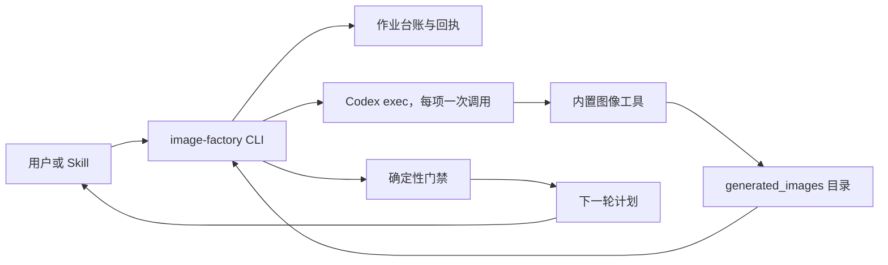
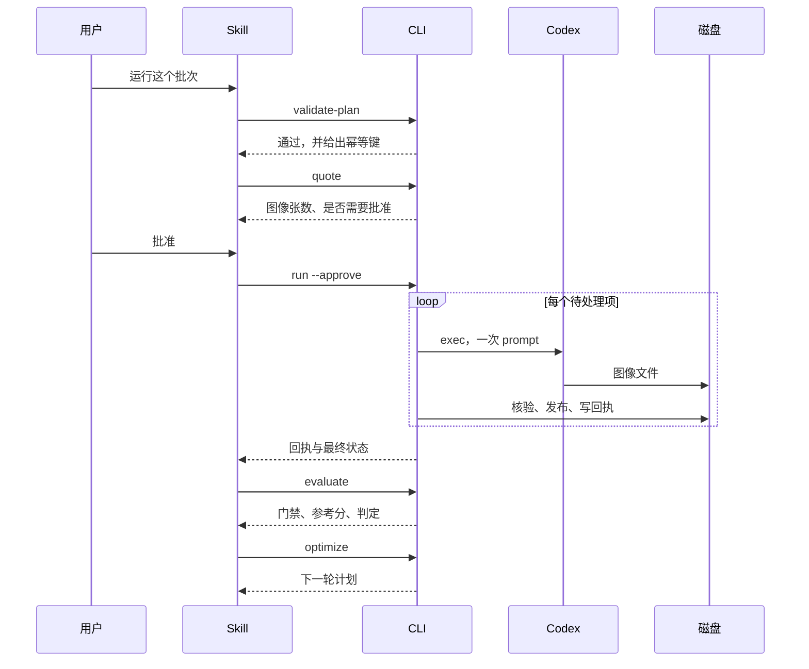

# Codex Image Factory 插件架构

> **状态**：已实现并通过离线验证；尚未记录运行期出图证据。**版本**：0.1.0。**更新日期**：2026-09-12。

[English](Codex-Image-Factory-Plugin-Architecture.md) | [简体中文](Codex-Image-Factory-Plugin-Architecture.zh_CN.md)

## 1. 架构驱动与范围

做一组风格统一的图是重复劳动：看参考图、猜 prompt、生成、对比、调整、再生成，最后留下一个能用的结果。每个主体、每个变体都要重来一遍，而成果通常只是一段贴在聊天窗口里的 prompt，事后无从复现。

本插件把这件事变成可重跑、可审计、可恢复的批次。驱动因素按重要性排列：

1. **结果必须可复现。** 批次是一份文档，一次运行有记录，每件产物都有回执，回执里的哈希由磁盘文件独立重算。
2. **花费必须是有意的。** 报价免费，运行不免费；被打断的批次是恢复而不是重复。
3. **判断必须诚实。** 机器能判的交给机器判；模型的意见作为信号记录，人的决定权重最高。

范围之外：单张即时要图、原地修改图像内容、提供服务端。插件是本地工具，且自身不出图。

## 2. 系统上下文

信任边界值得明说。插件信任 Codex 完成生成并报告行为，但不把这份报告当证据：只有生成目录里出现了新文件，且其哈希、大小、尺寸都由磁盘重算通过，一个步骤才算完成。插件从不读取、复制或保存认证材料；凭据由 Codex 自行管理。

## 3. 组件职责

| 组件 | 负责 | 不负责 |
| --- | --- | --- |
| `scripts/capability_probe.py` | 读取本地环境，判断批次能否运行 | 安装或修复任何东西 |
| `scripts/schema_lite.py` | 执行已发布的 JSON Schema | 定义 schema 未声明的契约 |
| `scripts/plan_validator.py` | 批次清单校验、幂等键、花费上限 | 生成任何图像 |
| `scripts/generation_runner.py` | 每项一次 Codex 调用与失败分类 | 重试，撰写 prompt |
| `scripts/artifact_collector.py` | 定位、核验、发布产物；生成回执 | 判断结果好不好 |
| `scripts/job_ledger.py` | 持久作业状态、原子写、拒绝密钥 | 花费决策 |
| `scripts/evaluator.py` | 确定性门禁、参考分记录、人工标注 | 调用模型 |
| `scripts/optimizer.py` | 决定哪些项要重做，产出下一轮文档 | 撰写改写文本 |
| `scripts/image_factory_cli.py` | 花费门禁与 Skills 调用的子命令 | 上述任何逻辑 |
| `skills/*` | 决定运行哪条命令并汇报结果 | 确定性状态 |

## 4. 核心流程

失败、取消与超时语义：

- **超时**只结束该项，归类为 `timeout`，不重试；批次继续处理其余项。
- **用量超限**终止整个批次，记录限额 id 与重置时间，该次运行不再尝试任何项。
- 退出码为 0 但**没有产物**属于失败，不是成功。生成方的声明与磁盘的证据是两件事。
- **取消**会让台账停在 `Running`，已完成的项已记录在案，下次运行会跳过它们。

## 5. 契约

四份文档构成接口，全部以 `additionalProperties: false` 封闭。

**`schemas/image_batch.schema.json`** —— 一个批次轮次。必填 `schema_version`、`batch_id`、`round`、`items`。批次项包含 `id`、`prompt` 与至多五张 `reference_images`。schema 刻意没有 `size`、`quality`、`background`、`n`、`model` 字段：内置工具一个都不接受，在这里接受它们等于做出平台无法兑现的承诺。

**`schemas/artifact_receipt.schema.json`** —— 一件已采集的产物。包含路径、`sha256`、`bytes`、`width`、`height`、`prompt_sha256`、`idempotency_key`，以及记录生成会话与调用号的 `source` 块。`source.model_reported` 可为空且实际为 `null`：插件只记录 Codex 报告的内容，从不已推断模型。

**`schemas/factory_job.schema.json`** —— 台账。约束状态机、批次项状态与封闭的失败分类集合。

**`schemas/scores.schema.json`** —— 一次评测。把 `deterministic_gates` 与 `advisory`、`human_labels` 分开，并以 `pass`、`fail` 或 `pending_approval` 收尾。

## 6. 平台边界

以下是 Codex 图像工具的实测性质，不是偏好设定；插件围绕它们设计，并如实记录而不是绕开：

- 图像模型由 Codex 选择。本仓库不硬编码任何模型名、不承诺任何模型名，只记录运行报告的内容。
- 工具只接受 prompt 与参考图。尺寸、质量、背景、张数固定，因此批次项之间的差异只能来自 prompt 与参考图。
- 一次调用产出一张图；编辑最多接受五张参考图。
- 出图消耗账号的图像额度。插件先估算批次、要求批准，且绝不重试。

若日后需要由插件自持 API 通道，那是带独立凭证的扩展点。本仓库不新增该通道，也不读取任何 API Key。

## 7. 安全与可靠性

- **默认不可生成。** 计划要求批准时，`run` 在没有 `--approve` 的情况下拒绝启动。
- **不绕开审批。** 插件从不传 `--dangerously-bypass-approvals-and-sandbox` 或 `--dangerously-bypass-hook-trust`，用户配置的审批姿态保持不变；测试断言这些 flag 绝不会出现在调用中。
- **不静默重试。** 代码中没有任何重试循环。失败的项被记录并上报。
- **密钥是被拒绝而非被清洗。** 台账在读写两侧都拒绝形似凭据的键，因此台账始终可以安全地作为证据分享。
- **原子写。** 台账写入经临时文件、`fsync`、`os.replace`，读者看到的是前一状态或后一状态，不会是撕裂状态。
- **独立核验。** 哈希与尺寸全部重算，发布后再复核一次，以发现验证窗口内被改写的文件。
- **重复内容被上报而非隐藏。** 两项产出同一张图时，所有参与者都会被标记——因为"该归谁"无法从文件本身判定。
- **不使用 shell。** 调用一律是 argv 数组，`shell=False`。

## 8. 部署与兼容

插件是 Codex 插件，使用 `.codex-plugin/plugin.json` 兼容清单与 URL marketplace 条目。没有 MCP 服务、没有守护进程、没有网络监听；根级 portable `plugin.json` 与 `mcp.json` 有意保持未激活，理由记录在 `docs/portable-migration.md`。

运行期前置条件：用户已安装的 Codex、已登录且套餐包含图像生成的账号、可写的 `$CODEX_HOME/generated_images` 目录。`bin/image-factory probe` 会指出缺哪一项以及该怎么处理，且不联网、不执行任何程序。

`tomllib` 需要 Python 3.11 或更高版本。全部脚本仅使用标准库。

## 9. 演进

设计留下三个清晰的接缝：

- **另一条出图通道。** `generation_runner` 是唯一与生成方对话的模块。若日后需要可显式控制参数的通道，它是在同一套台账与回执之后的另一个适配器。
- **可校准的参考分。** 每份 `scores.json` 已经把人工标注与参考分并列记录。积累足够后，参考分可以拿真实决定来度量，而不是被信任。
- **更多产物类型。** Recipe、fixture 与评分目前围绕图像塑形。视频会新增一条流水线，而不是第二本台账。
