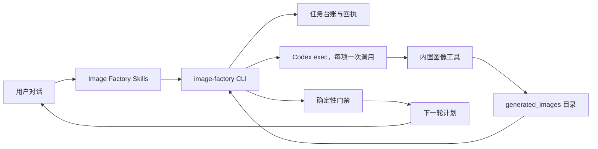
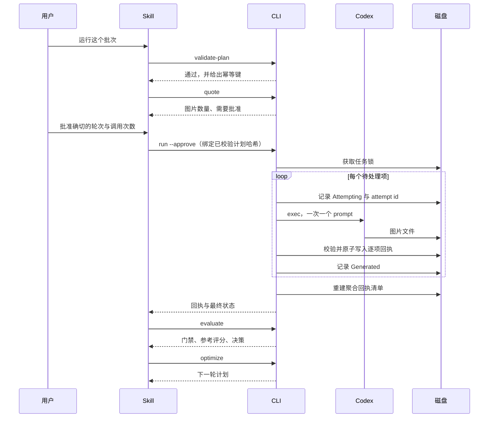

# Image Factory 插件架构

> **文档信息**
>
> | 字段 | 值 |
> |---|---|
> | 状态 | 0.1.2 release candidate（发布候选）；九项外部门禁已观测七项，生成路径已在 macOS 验证 |
> | 范围 | 已实现的批量图像内核与提示词发现层 |
> | 读者 | 本插件的维护者、审阅者与集成者 |
> | 不在范围 | 工作台界面、父项目状态与非图片媒体管线 |
> | 运行证据 | `docs/verification/` |
> | 最近一次结构修订 | 2026-09-14 |

[English](Codex-Image-Factory-Plugin-Architecture.md) | [简体中文](Codex-Image-Factory-Plugin-Architecture.zh_CN.md)

## 1. 执行摘要

做一组风格统一的图是重复劳动：看参考图、猜 prompt、生成、对比、调整、再生成，最后留下一个能用的结果。每个主体、每个变体都要重来一遍，而成果通常只是一段贴在聊天窗口里的 prompt，事后无从复现。

本插件把这件事变成可重跑、可审计、可恢复的批次。插件自身绝不出图：生成由 Codex 通过其内置图像工具完成，而本仓库负责计划、花费门禁、回执、评测与恢复。

## 2. 驱动力与约束

驱动因素按重要性排列：

1. **结果必须可复现。** 批次是一份文档，运行有记录，每件产物都带一份从文件重算哈希的回执。
2. **花费必须是有意的。** 报价免费，运行不免费；中断的批次是恢复而不是重来。
3. **判断必须诚实。** 能机械判定的由机器判定；模型意见作为信号记录，人的决定高于两者。

| 驱动力 | 对架构的后果 |
|---|---|
| 可复现 | 封闭的计划 schema 与按内容派生的幂等键 |
| 花费有意 | 免费的报价步骤，以及绑定已校验计划哈希的批准 |
| 判断诚实 | 确定性门禁做主判，参考评分与人工标注并列记录 |
| 可审计 | 每件产物一份原子写入、schema 合法、经哈希校验的回执 |

### 非目标

按需生成单张图、就地编辑图像内容、提供托管服务。插件是本地的，且自身不出图。

## 3. 上下文与信任边界

Codex 对话就是产品界面。Skills 呈现方向选择、一张紧凑的创作确认卡、确切的调用次数、编号结果与下一步决策。计划、幂等键、回执与路径留在磁盘上供审计，而不是变成用户必须操作的表单。

信任边界值得明说。插件信任 Codex 去执行生成并报告它做了什么，但不把这份报告当作证据：只有当生成目录里出现新文件，且其哈希、大小与尺寸从磁盘重算通过时，一个步骤才算完成。插件绝不读取、复制或存储认证材料；Codex 管理自己的凭据。

## 4. 当前状态、目标状态与差距

| 能力 | 当前 | 目标 | 差距 |
|---|---|---|---|
| 提示词发现 | 已实现，离线且带来源标注 | 不变 | 无 |
| 批次计划校验与花费上限 | 已实现 | 不变 | 无 |
| 批准门禁 | 已实现，绑定已校验计划哈希 | 不变 | 无 |
| 回执采集与校验 | 已实现，发布后再做一次校验 | 不变 | 无 |
| 评测 | 确定性门禁 + 参考评分 + 人工标注 | 不变 | 无 |
| 恢复 | 已实现；核对回执而不重新调用 Codex | 不变 | 无 |
| 显式尺寸、质量或模型控制 | 按平台设计不可用 | 不变 | 属于范围之外，而非"计划中" |
| 用量上限证据 | `NOT_RUN`；耗尽额度既无必要也未被授权 | 不变 | 有意未执行 |
| 远程 CI、源码/远程/标签一致性、全新安装、付费金丝雀 | 未运行 | 已验证 | 外部门禁 |

## 5. 原则与决策

| 决策 | 理由 | 反转条件 |
|---|---|---|
| 回执是事实源，而不是一句声明 | 生成器可能退出码为零却什么也没产出 | 无 |
| 任何地方都没有重试循环 | 源码写得很直白：静默重试就是"一个坏 prompt 变成一张大账单"的成因 | 无 |
| 拒绝形似凭据的台账键，而不是清洗它们 | 台账必须永远可以作为证据分享 | 无 |
| 没有明确批准就拒绝启动 | 花费门禁是产品属性，不是便利功能 | 无 |
| 记录参考评分但不采信它 | 模型意见是需要校准的信号，不是判决 | 当人工标注足以做校准时 |
| 让 schema 比工具更窄 | 接受一个不受支持的字段，等于许下平台无法兑现的承诺 | 若平台增加显式参数控制 |

## 6. 组件与依赖

| 组件 | 负责 | 不负责 |
| --- | --- | --- |
| `scripts/capability_probe.py` | 读取本地环境以判断批次能否运行 | 安装或修复任何东西 |
| `scripts/schema_lite.py` | 强制已发布的 JSON Schema | 定义 schema 未声明的契约 |
| `scripts/plan_validator.py` | 批次计划校验、幂等键、花费上限 | 生成任何内容 |
| `scripts/prompt_library.py` | 离线且带来源的模板与分类发现 | 调用生成器或执行上游 Skill |
| `scripts/generation_runner.py` | 每项一次 Codex 调用与失败分类 | 重试，以及写 prompt |
| `scripts/artifact_collector.py` | 定位、校验并发布产物与回执 | 判定结果好不好 |
| `scripts/job_ledger.py` | 持久任务状态、原子写、拒绝秘密 | 花费决策 |
| `scripts/evaluator.py` | 确定性门禁、参考记录、人工标注 | 调用模型 |
| `scripts/optimizer.py` | 决定哪些项要重做，以及下一轮文档 | 撰写改写内容 |
| `scripts/image_factory_cli.py` | 花费门禁与 Skills 调用的子命令 | 上述任何逻辑 |
| `skills/*` | 决定运行哪条命令并报告结果 | 确定性状态 |

## 7. 运行期与核心流程

失败、取消与超时语义：

- **预留之后超时或被中断的子进程**结果是含糊的。除非有有效的逐项回执能证明完成，否则该项变为 `Unknown`；绝不自动重试。
- **用量上限**会停止整批。上限标识与重置时间会被记录，该次运行不再尝试任何后续项。
- **退出码为零但产物缺失**属于失败，而不是成功。生成器的声明与磁盘的证据是两回事。
- **取消**会保留持久的 `Attempting` 证据。恢复要么验证其回执，要么把它改成 `Unknown`；绝不把它变回待处理。

## 8. 契约、状态与数据

四份文档构成接口，每份都用 `additionalProperties: false` 封闭。

**`schemas/image_batch.schema.json`**——一个批次轮次。要求 `schema_version`、`batch_id`、`round` 与 `items`。项携带 `id`、`prompt`，以及至多五张 `reference_images`。schema 刻意没有 `size`、`quality`、`background`、`n` 或 `model` 字段：内置工具一个都不接受，在这里接受它们等于许下平台无法兑现的承诺。

**`schemas/artifact_receipt.schema.json`**——一件已采集产物。携带 path、`sha256`、`bytes`、`width`、`height`、`prompt_sha256` 与 `idempotency_key`，并含一个 `source` 块标明生成会话与调用。`source.model_reported` 可为空，实践中就是 `null`：插件只记录 Codex 报告的内容，绝不推断模型。

**`schemas/factory_job.schema.json`**——1.1.0 台账。约束状态机、批准历史、计划哈希绑定与 `Attempting`/`Unknown` 的生命周期。旧版 1.0.0 文档在内存中迁移，既不臆造批准证据，也不改变既有观测结果。

**`schemas/scores.schema.json`**——一次评测。把 `deterministic_gates` 与 `advisory`、`human_labels` 分开，并以 `pass`、`fail` 或 `pending_approval` 的 `decision` 收束。

| 数据 | 所有者 | 位置 | 一致性 |
|---|---|---|---|
| 任务台账 | CLI | `--job` 路径，或 `<plan>.job.json` | 经临时文件、`fsync` 与 `os.replace` 的原子写 |
| 逐项回执 | 采集器 | `<job>.receipts/` | 每项一份原子写入、schema 合法、经哈希校验的文件 |
| 聚合清单 | CLI | 台账旁 | 只是投影；恢复期可重建 |
| 产出的图片 | Codex 图像工具 | `$CODEX_HOME/generated_images` | 从磁盘校验，而非依据声明 |

## 9. 平台边界

以下是 Codex 图像工具的实测性质，不是偏好设定。插件围绕它们设计，并把它们记录下来而不是绕开：

- 图像模型由 Codex 选择。本仓库不硬编码任何模型名、不承诺任何模型，只记录一次运行实际报告的内容。
- 工具接受 prompt 与参考图。尺寸、质量、背景与张数是固定的，因此批次项之间只能靠 prompt 与参考图区分。
- 一次调用产出一张图，且编辑最多接受五张参考图。
- 生成会消耗账号的图像额度。插件先估算批次、要求批准，且绝不重试。

由插件自持的 API 通道将是另一个需要独立凭据的扩展点。本仓库不新增，也不读取任何 API Key。

## 10. 安全与可靠性预算

- **默认不控制生成。** 若计划要求批准，`run` 在未给出 `--approve` 时拒绝启动。
- **不能绕过批准。** 插件绝不传 `--dangerously-bypass-approvals-and-sandbox` 或 `--dangerously-bypass-hook-trust`；用户的批准姿态始终有效。测试断言这些标志永不出现于调用中。
- **没有静默重试。** 任何地方都没有重试循环。失败项被如实记录并报告。
- **单一跨进程写者。** 基于任务路径的 OS 锁覆盖批准、预留、调用、回执持久化与最终状态迁移。第二个写者会在调用 Codex 之前以 `job_already_running` 失败。
- **回执是权威。** 每项一份原子写入、schema 合法、经哈希校验的回执就是事实源。聚合清单只是投影，恢复期可重建。
- **配置了人工标注就是强制的。** 在必需标注缺失时，确定性成功与参考评估都无法产出 `pass`。
- **秘密被拒绝，而不是被清洗。** 台账在读写两侧都拒绝形似凭据的键，因此台账永远可以安全地作为证据分享。
- **原子写。** 台账写入经临时文件、`fsync` 与 `os.replace`，读者只会看到前一个或下一个状态，绝不会看到撕裂状态。
- **独立校验。** 哈希与尺寸会被重算，发布之后的二次校验能发现验证窗口内被改写的文件。
- **重复内容会被报告而不是隐藏。** 两个项产出完全相同的图片时，会向所有参与方标记，因为"哪一项该拥有这份内容"无法从文件判断。
- **不用 shell。** 调用是带 `shell=False` 的 argv 数组。

| 预算 | 值 | 理由 |
|---|---|---|
| 每项每次运行的调用次数 | 一次 | 第二次调用是一个新决策，而不是重试 |
| 批准绑定 | 已校验计划哈希 | 一次批准不得授权被改动的计划 |
| 并发写者 | 一个 | 第二个写者可能造成重复花费 |
| 停止规则 | 任务项失败即该项终态 | 只有 `optimize` 能产出下一轮 |
| 缺失的用量上限证据 | `NOT_RUN` | 耗尽额度既无必要也未被授权 |

## 11. 部署、兼容性与演进

插件是 Codex 插件，兼容清单位于 `.codex-plugin/plugin.json`，并有 URL marketplace 条目。没有 MCP 服务器、没有守护进程、没有网络监听；便携根 `plugin.json` 与 `mcp.json` 有意保持未激活，`docs/portable-migration.md` 有记录。

运行前置：用户已有的 Codex 安装、一个其套餐包含图像生成的已登录账号，以及可写的 `$CODEX_HOME/generated_images` 目录。`bin/image-factory probe` 会报告缺少哪一项以及该怎么办，且不访问网络、不执行任何东西。

需要 Python 3.11 或更新版本以使用 `tomllib`。所有脚本只用标准库。GitHub Actions 定义六个离线格：Linux、macOS 与 Windows，分别配 Python 3.11 与 3.13。每格都会编译源码、跑完整测试、校验分发并检查 diff，且不安装运行依赖。

本文档描述已实现的 0.1.2 发布候选图像内核与提示词发现层。工作台界面、父项目状态与非图片媒体管线属于其他产品职责，不在本插件仓库内实现或规划。

设计留下三处干净的接缝：

- **另一条生成通道。** `generation_runner` 是唯一与生成器对话的模块。带显式参数控制的第二条通道将是同一套台账与回执之后的新适配器。
- **可校准的参考评分。** 每个 `scores.json` 里人工标注已经与参考评分并列记录。积累足够后可把参考信号与真实决策对比，而不是直接采信。
- **面向图片的派生产物。** 配方、夹具、回执与评分都围绕图片成形；非图片媒体属于其所属产品。

| 风险 | 缓解 |
|---|---|
| 生成器报告成功却没产出文件 | 证据是产物，不是退出码 |
| 中断的运行重复花费 | 台账通过核对已校验回执来恢复 |
| 模型意见变成判决 | 确定性门禁做主判，评分仅供参考 |
| 凭据泄漏进共享证据 | 台账在读写两侧都拒绝形似凭据的键 |

## 12. 证据映射

| 断言 | 证据 |
|---|---|
| 计划 schema 与上限 | `schemas/image_batch.schema.json`、`scripts/plan_validator.py` |
| 花费门禁 | `scripts/image_factory_cli.py` 与批准相关测试 |
| 回执校验 | `scripts/artifact_collector.py` 及其测试 |
| 台账与拒绝秘密 | `scripts/job_ledger.py` 及其测试 |
| 不重新生成的恢复 | `scripts/image_factory_cli.py` 的 `recover`、`docs/verification/runtime.md` |
| 外部门禁状态 | `docs/verification/runtime.md`、`docs/verification/offline.md` |
