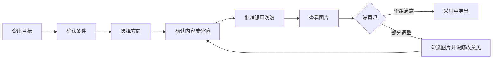

# Codex Image Factory Creative Studio 用户手册

> 本手册描述目标产品体验。当前 0.1.1 已支持提示词检索、计划校验、报价、批量图片生成、回执、
> 恢复和评测；图形化 Creative Studio 在 0.2.x 实施，本地故事视频在 0.3.0 实施。

## 1. 最简单的使用方式

只输入你真正想要的结果，不需要先写提示词：

```text
给我的新中式茶叶品牌做一套小红书首发视觉，年轻、克制、有东方气质。
```

系统自动识别为“社交内容 + 产品营销 + 系列视觉”，推荐用途、画风、构图、文字、
数量和一致性设置。你可以直接接受默认值，也可以点选修改。



## 2. 九个页面怎么用

| 页面 | 你需要做什么 | 可以直接使用默认值吗 |
| --- | --- | --- |
| 创作目标 | 写一句目标，可上传参考图 | 目标必须填写 |
| 条件选择 | 查看系统预选的类型、用途、风格、数量 | 可以 |
| 视觉方向 | 从最多三个方向中点选一个 | 需要选一个 |
| 内容/分镜 | 看每张图要表达什么 | 可以；也可自然语言改某一张 |
| 生成报价 | 核对图片数量和调用次数 | 必须主动批准 |
| 生成进度 | 等待并查看逐张状态 | 不需要操作 |
| 结果确认 | 整组采用或选择需要调整的图片 | 必须做最终选择 |
| 视频制作 | 选择时长、字幕、旁白和转场 | 只做图片时跳过 |
| 导出 | 下载图片、视频和项目记录 | 可以使用推荐格式 |

## 3. 条件怎么选

### 创作类型

单张图片适合封面和主视觉；系列视觉适合社交账号、电商详情页或同一角色的多幅画面；
绘本/漫画会先生成故事节拍；信息图会优先整理信息层级；本地故事视频会先完成并批准
图片，再合成视频。

### 用途

用途决定信息密度和构图重点。小红书重视竖向浏览与第一眼吸引力；淘宝重视商品识别
和卖点；公众号重视标题区与文章语气；演示文稿重视横向结构和留白；印刷重视交付
规格和边距。

### 视觉方向

系统最多提供三个方向，每个方向包含预览、适用理由、模板来源和视觉 DNA 摘要。
视觉 DNA 是系列图片共享的角色、产品、场景、材质、光线和配色规则。

### 文字

选择“无文字”时，系统会明确禁止标题和水印；选择“标题”或“完整文案”时，原文会
逐字保存。最终仍要人工核对图片中的汉字、数字、价格、日期和品牌名。

### 版式与比例

方形、竖版、横版和宽屏首先作为构图意图交给 Codex。当前内置图像工具不允许插件
精确指定生成尺寸。0.2.1 会保留原图，并通过本地派生步骤输出准确宽高的交付文件。

### 参考图

每张参考图要选择一个角色：

- 主体参考：保留人物、产品或角色身份。
- 风格参考：学习画笔、材质、光线和色彩。
- 构图参考：学习空间布局和镜头位置。
- Logo/包装参考：保留标识与结构。
- 编辑目标：只修改明确指定的部分。

## 4. 多图和绘本

系列任务先建立共享视觉 DNA，再拆成每张图片的任务。以“守株待兔”为例，系统会
先判断故事需要的关键事件，再给出分镜。人物服饰、树桩、田地和画风在所有分镜中
保持一致；每幅只改变动作、机位、时间和情绪。

默认审阅方式是整组查看。你可以：

- 点击“整组采用”；
- 勾选第 2、5 张并输入“兔子的动作更明显，荒田再干枯一些”；
- 驳回一张并保留其他已批准图片；
- 对比新旧轮次后再选择。

系统只对选中项生成新轮次，并重新展示新增调用次数。

## 5. 参考图库怎么参与

系统先查本地固定版本目录：22 套工业模板、31 类案例索引和 11 类大图库目录。
搜索结果只帮助选择方向，不会自动执行上游 Skill 中的 API、安装或联网命令。

采用外部案例时，界面高级信息会显示：来源仓库、固定提交、许可证、案例编号、
原始预览和改写说明。找不到模板时，Codex 会根据用户目标原创方向，并标记“未使用
图库模板”。

## 6. 生成和费用确认

报价页显示本轮图片数量和调用次数。一张图片对应一次 Codex 图像生成调用。只有你
批准后才运行；插件不自动重试失败项。额度耗尽时，剩余图片保留为待处理状态。

关闭页面不会丢失项目。重新打开后，系统从父项目和 Image Factory 台账恢复，跳过
已有回执的图片。

## 7. 结果确认

系统先检查文件是否存在、PNG 是否有效、尺寸是否达标、哈希是否一致、不同任务是否
错误地产生相同图片。这些是确定性门禁。

Codex 还会给出主体、构图、文字、风格和系列一致性的建议，但建议分不能覆盖文件
失败，也不能覆盖你的驳回。最终采用必须来自人工确认。

## 8. 本地故事视频

0.3.0 使用已批准图片制作故事视频，支持镜头排序、时长、推拉、平移、淡入淡出、
字幕、用户音频、本机旁白和背景音乐混合。输出为本地 MP4 并附媒体回执。

这条能力不会生成角色连续动作或口型。需要原生文生视频的请求会显示为当前不支持，
不会自动转接外部视频平台。

## 9. 常见输入示例

```text
做一张小红书封面：主题是“普通人如何开始跑步”，不要人物照片。
```

```text
根据这张包装图做 5 张同一风格的茶叶卖点图，包装结构必须保持。
```

```text
把“守株待兔”做成适合 6–9 岁儿童的完整绘本，画面温暖，不出现受伤细节。
```

```text
把这篇技术文章做成一张横版信息图，所有模块标题必须使用我提供的中文原文。
```

```text
用批准的 8 张绘本图做一个 45 秒竖屏视频，带字幕和温和的本地旁白。
```

完整案例见[使用案例目录](../use-cases/README.zh-CN.md)。
