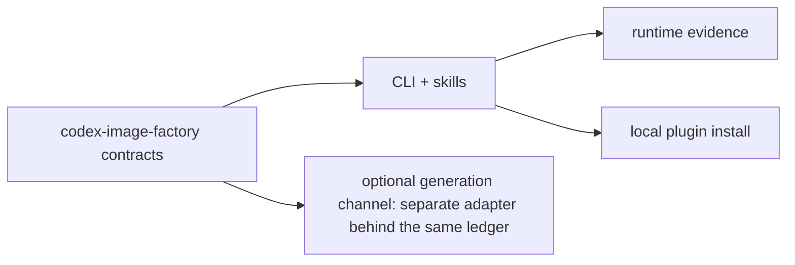

# Codex Image Factory Plugin Implementation Plan

> **For agentic workers:** REQUIRED SUB-SKILL: Use superpowers:subagent-driven-development (recommended) or superpowers:executing-plans to implement this plan task-by-task. Steps use checkbox (`- [ ]`) syntax for tracking.

**Goal:** Build a batch image production loop for Codex that validates a plan, generates with explicit approval, collects a hash-verified receipt per artifact, evaluates against deterministic gates, and plans the next round.

**Architecture:** Skills call a deterministic CLI. The CLI never generates an image: it invokes `codex exec` once per item and collects whatever new file appears in the generation directory. State lives in an atomically written ledger keyed by content-derived idempotency keys, so a resumed run skips finished work and never repeats a failed one.

**Tech Stack:** Codex plugin manifest, Agent Skills, Python 3.11+, JSON Schema, stdlib `unittest`, stdlib `tomllib`, `zlib`/`struct` for PNG header reads.

**Spec:** `docs/superpowers/specs/2026-09-12-codex-image-factory-plugin-design.md`

## Global Constraints

- Plugin ID is `codex-image-factory`; version stays `0.1.0` for the compatibility foundation.
- No `size`, `quality`, `background`, `n`, or `model` field may appear in a batch item.
- No model name may be hardcoded anywhere; receipts record `null` when Codex reports none.
- Exactly four skills: `codex-image-factory-{use,run,judge,recover}`.
- No MCP configuration, no root `plugin.json`, no root `mcp.json`, no symlinks.
- Standard library only. No third-party imports in `scripts/`.
- Every Codex invocation is an argv array with `shell=False`; the approval-bypass flags are never passed.
- Nothing retries automatically, and nothing installs software.
- Every schema is closed with `additionalProperties: false` and enforced by `scripts/schema_lite.py`.

## Foundation baseline completed 2026-09-12

The repository already contains the validated `codex-image-factory` compatibility manifest, URL marketplace entry, Apache-2.0 and legal files, transparent brand assets generated from `assets/logo.svg`, four closed schemas, the distribution validator, and the offline test suite. Tasks below record how that was built and what remains. Later work must extend these files rather than recreate them.

### Task 1: Contracts and distribution foundation

- [x] Write failing identity and schema tests.
- [x] Add `.codex-plugin/plugin.json`, `.agents/plugins/marketplace.json`, the four schemas, legal files, brand assets, and `scripts/validate_distribution.py`.
- [x] Run tests and both validators; commit `feat: define Image Factory contracts`.

### Task 2: Capability probe

- [x] Write failing tests for binary discovery, auth presence, feature overrides, provider capability, directory writability, and — importantly — that the probe never spawns the binary.
- [x] Implement `scripts/capability_probe.py` as filesystem-only detection with an explicit binary override.
- [x] Confirm the probe reports `null` for the model and lists what it could not verify; commit `feat: probe Codex image generation capability`.

### Task 3: Plan validation

- [x] Write failing tests for schema enforcement, idempotency key derivation from content, duplicate ids, caps, and missing reference images.
- [x] Implement `scripts/schema_lite.py` driven by the published schema, then `scripts/plan_validator.py`.
- [x] Confirm a plan asking for a size or quality tier is rejected and that validator constants match the schema; commit `feat: validate batch plans`.

### Task 4: Artifact collection

- [x] Write failing tests for directory diffing, PNG header reads, hash recomputation, duplicate content, and the second-check gates.
- [x] Implement `scripts/artifact_collector.py` with atomic publication and receipts.
- [x] Confirm a source rewritten mid-collection fails instead of being recorded; commit `feat: collect and receipt generated artifacts`.

### Task 5: Durable job ledger

- [x] Write failing tests for the state machine, terminal `Failed`, atomic writes, secret refusal on read and write, and idempotent resumption.
- [x] Implement `scripts/job_ledger.py`.
- [x] Confirm every written ledger validates against `schemas/factory_job.schema.json`; commit `feat: persist and recover Image Factory jobs`.

### Task 6: Generation orchestration

- [x] Write failing tests using a fake `codex exec` for success, generation, failure, usage limit, timeout, and silent exit.
- [x] Implement `scripts/generation_runner.py`, including that a zero exit without a new file is `artifact_missing`.
- [x] Confirm the recorded argv carries `--json`, `-C`, `-o`, reference images, and no bypass flag; commit `feat: orchestrate Codex image generation`.

### Task 7: Evaluation

- [x] Write failing tests for each deterministic gate, duplicate flagging for every participant, advisory precedence, and human-label precedence.
- [x] Implement `scripts/evaluator.py` with no model call of its own.
- [x] Confirm the scores document conforms to `schemas/scores.schema.json`; commit `feat: evaluate generated batches`.

### Task 8: Optimization loop

- [x] Write failing tests for carried-forward items, the instruction contract, the round ceiling, and that the previous plan is never mutated.
- [x] Implement `scripts/optimizer.py`.
- [x] Confirm the next round conforms to the batch schema and that keys differ between rounds; commit `feat: optimize image recipes`.

### Task 9: CLI and Skills

- [x] Write failing tests for every subcommand, the approval gate, resumption, and usage-limit stop.
- [x] Implement `scripts/image_factory_cli.py`, `bin/image-factory`, and the four skills.
- [x] Confirm each skill names the command it drives, forbids installs and retries, and states the platform boundary; commit `feat: add Image Factory workflows`.

### Task 10: Evidence and documentation

- [x] Write the bilingual architecture and technical solution documents.
- [x] Record offline evidence in `docs/verification/offline.md` with a coverage map.
- [x] Add `tests/test_distribution_extended.py` for structure, links, and documentation markers; commit `test: verify Image Factory distribution`.

---

## Detailed executor contract

### Task 11 — runtime evidence

**Files:** modify `docs/verification/runtime.md`; no source changes.

- [x] Run `bin/image-factory probe` on a machine whose account includes image generation and record the verdict verbatim.
- [x] Run a two-item batch with `--approve` against a real account and record the receipts, the ledger's final state, and the published files.
- [x] Record, not assume, which model the run reports, and whether a usage limit was encountered.
- [x] If no such account is available, mark each gate `NOT_RUN` with the specific missing evidence rather than describing a hypothetical result. (Not applicable: an authorized account was available.)
- [x] Commit `test: record Image Factory runtime evidence`.

### Task 12 — plugin installation

**Files:** no repository changes; installs `codex-image-factory` locally.

- [x] Confirm the marketplace entry resolves and the plugin installs with `codex-image-factory` as its identity.
- [x] Confirm a new Codex session discovers all four skills.
- [x] Confirm the skill text is loaded and the CLI is reachable from a session.
- [x] Commit nothing; record the outcome in `docs/verification/runtime.md`.

## Completion gate

```text
contract_tests = PASS
probe_tests = PASS
plan_validation_tests = PASS
collector_tests = PASS
ledger_tests = PASS
runner_tests = PASS
evaluator_tests = PASS
optimizer_tests = PASS
cli_tests = PASS
skill_tests = 4/4
plugin_validation = PASS
secret_matches = 0
runtime_generation_evidence = observed evidence or explicit NOT_RUN
```

## Cross-repository execution order


