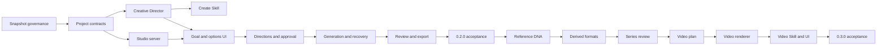

# Codex Image Factory Creative Studio Implementation Plan

> **For agentic workers:** REQUIRED SUB-SKILL: Use superpowers:subagent-driven-development (recommended) or superpowers:executing-plans to implement this plan task-by-task. Steps use checkbox (`- [ ]`) syntax for tracking.

**Goal:** Build a local, responsive Creative Studio where a user enters one creative goal, confirms AI-selected conditions, approves a quote, receives images, reviews them, and optionally renders an approved set into a local story video.

**Architecture:** A loopback Python standard-library server hosts a vanilla HTML/CSS/JS wizard and coordinates a new parent project state machine. Codex produces schema-constrained briefs, directions and plans; the existing Image Factory remains the only image-generation and receipt engine. Pinned upstream Skill snapshots stay inactive and feed a normalized attributed catalog. FFmpeg is an optional local video adapter behind the same parent project.

**Tech Stack:** Python 3.11+ standard library, Codex CLI and built-in image tool, closed JSON Schema, vanilla HTML/CSS/JavaScript, Server-Sent Events, FFmpeg/ffprobe for optional video, stdlib `unittest`.

**Spec:** `docs/superpowers/specs/2026-09-13-codex-creative-studio-design.md`

## Global Constraints

- The only remote generator is Codex through the user's existing authentication; do not add API keys or an external image/video API.
- `vendor/upstream/` is immutable reference data and is never part of the active `skills/` inventory or an executable search path.
- Every new JSON contract is draft 2020-12, closed with `additionalProperties: false`, and enforced by `scripts/schema_lite.py`.
- The existing image plan, ledger, receipt and score contracts remain backward compatible.
- Every spend-changing action verifies the approved plan hash, round and call count; no automatic retry.
- The server listens only on `127.0.0.1`, uses a random port and one-time session token, and restricts project paths to an explicit project root.
- Image layout choices are prompt intent; exact delivered dimensions come only from verified files or deterministic derived artifacts.
- Video 0.3.0 is local still-image composition; do not claim native text-to-video, character motion or lip sync.
- Mobile 390×884, Tablet 768×1024 and Desktop 1280×1024 are required viewport gates.

---

## Pre-implementation baseline completed 2026-09-13

- [x] Preserve four upstream Skills and one licensed gallery snapshot at pinned revisions under `vendor/upstream/`.
- [x] Verify 77 vendored files against their GitHub Git blob SHAs with zero mismatches.
- [x] Keep two sources without declared licenses as commit-pinned pointers only.
- [x] Record the capability analysis, target architecture and responsive product flow.
- [x] Pass the current 238-test regression suite and distribution validator.

These checks establish source and planning evidence only. Tasks below implement
the product; no unchecked task is implied complete by this baseline.

## Release 0.2.0 — Creative Studio image loop

### Task 1: Govern upstream snapshots and build the normalized catalog

**Files:**
- Create: `scripts/upstream_snapshot.py`
- Create: `scripts/build_prompt_catalog.py`
- Create: `schemas/prompt_catalog.schema.json`
- Create: `data/catalog/prompt_catalog.json`
- Modify: `vendor/upstream/sources.json`
- Modify: `scripts/validate_distribution.py`
- Test: `tests/test_upstream_snapshots.py`
- Test: `tests/test_prompt_catalog.py`

**Interfaces:**
- Consumes: `vendor/upstream/sources.json` and pinned snapshot directories.
- Produces: `verify_snapshots(root: Path) -> SnapshotReport` and `build_catalog(root: Path) -> dict`.

- [ ] **Step 1: Add a failing snapshot integrity test.** Create a temporary source manifest with one file, assert a matching Git blob SHA passes, mutate one byte, and assert `snapshot_content_mismatch` includes the relative path.
- [ ] **Step 2: Run `python3 -m unittest tests.test_upstream_snapshots -v`.** Expected: failure because `scripts/upstream_snapshot.py` does not exist.
- [ ] **Step 3: Implement Git blob verification.** Hash `b"blob " + str(len(data)).encode() + b"\0" + data` with SHA-1, compare every declared file, refuse missing/extra files, and never execute snapshot content.
- [ ] **Step 4: Add failing catalog tests.** Assert the derived catalog contains stable template IDs, Chinese labels, categories, guidance, pitfalls, source revision, license and evidence level; assert unlicensed sources contribute pointers but no prompt body.
- [ ] **Step 5: Implement `build_prompt_catalog.py`.** Parse only the approved fields from the four licensed snapshots, normalize them into `prompt_catalog.schema.json`, sort deterministically, and write with UTF-8 plus a trailing newline.
- [ ] **Step 6: Extend distribution validation.** Require `vendor/upstream/sources.json`, licenses, zero active-Skill paths under `vendor/`, and a catalog that validates against its Schema.
- [ ] **Step 7: Run `python3 -m unittest tests.test_upstream_snapshots tests.test_prompt_catalog -v` and `python3 scripts/validate_distribution.py .`.** Expected: all pass and 77 initial snapshot files verify.
- [ ] **Step 8: Commit.** `git add vendor data/catalog schemas/prompt_catalog.schema.json scripts/upstream_snapshot.py scripts/build_prompt_catalog.py scripts/validate_distribution.py tests/test_upstream_snapshots.py tests/test_prompt_catalog.py && git commit -m "feat: govern upstream prompt skill snapshots"`.

### Task 2: Define the Creative Project contracts and parent state machine

**Files:**
- Create: `schemas/creative_brief.schema.json`
- Create: `schemas/visual_direction.schema.json`
- Create: `schemas/creative_project.schema.json`
- Create: `scripts/project_store.py`
- Test: `tests/test_project_store.py`

**Interfaces:**
- Produces: `CreativeProjectStore.create(goal, project_dir)`, `load()`, `transition(expected_revision, target, note=None)`, `record_artifact(kind, path, receipt=None)`.
- State values: `GoalCaptured`, `OptionsReady`, `DirectionReady`, `PlanReady`, `Quoted`, `Approved`, `Generating`, `Reviewing`, `Blocked`, `ImagesApproved`, `VideoPlanning`, `Rendering`, `VideoReview`, `Completed`.

- [ ] **Step 1: Write failing tests for project creation, closed Schemas, legal transitions, optimistic revision conflicts, atomic writes and secret-like key refusal.** Hand-check that a new project starts at revision 0 in `GoalCaptured` with no child jobs.
- [ ] **Step 2: Run `python3 -m unittest tests.test_project_store -v`.** Expected: import failure for `project_store`.
- [ ] **Step 3: Implement the three Schemas.** A brief stores raw goal separately from inferred/default/user-selected values; a direction carries `direction_id`, explanation, visual DNA, template evidence and preview; a project references child files rather than embedding their mutable contents.
- [ ] **Step 4: Implement `project_store.py`.** Reuse the existing ledger's secret detection and atomic-write pattern; require revision compare-and-swap before every mutation.
- [ ] **Step 5: Run the focused tests, then `python3 -m unittest discover -s tests -v`.** Expected: all current and new tests pass.
- [ ] **Step 6: Commit.** `git add schemas/creative_*.schema.json schemas/visual_direction.schema.json scripts/project_store.py tests/test_project_store.py && git commit -m "feat: add Creative Studio project contracts"`.

### Task 3: Implement the Creative Director with schema-constrained Codex output

**Files:**
- Create: `scripts/creative_director.py`
- Create: `schemas/creative_director_response.schema.json`
- Create: `tests/fakes/fake_codex_director.py`
- Test: `tests/test_creative_director.py`

**Interfaces:**
- `analyze_brief(goal: str, references: list[ReferenceRole], catalog: dict) -> CreativeBrief`
- `propose_directions(brief: CreativeBrief, matches: list[CatalogMatch], limit: int = 3) -> list[VisualDirection]`
- `build_image_plan(brief: CreativeBrief, direction: VisualDirection) -> dict`
- `rewrite_selected(plan: dict, feedback: dict[str, str]) -> dict`

- [ ] **Step 1: Write a fake Codex process that validates the argv and emits fixture JSON matching `creative_director_response.schema.json`.** It must fail when `--output-schema`, `--json`, `-C`, or a single positional prompt is absent.
- [ ] **Step 2: Write failing tests.** Cover one-sentence Chinese goals, already-specific briefs, at most three directions, preservation of exact user text, reference roles, story beat completeness, invalid JSON, unknown fields and prompt-injection text inside catalog records.
- [ ] **Step 3: Run `python3 -m unittest tests.test_creative_director -v`.** Expected: failure because the director is missing.
- [ ] **Step 4: Implement the director runner.** Pass the output Schema to Codex, provide only top catalog matches, wrap catalog text as untrusted reference data, and persist request/response evidence without credentials.
- [ ] **Step 5: Implement plan conversion.** Map direction/visual DNA into the existing `image_batch` fields only; repeat shared identity constraints in each series item; reject invented `model`, `size`, `quality`, `background` and `n` fields through the existing validator.
- [ ] **Step 6: Run focused and full tests.** Expected: deterministic fake coverage passes; no real image calls occur.
- [ ] **Step 7: Commit.** `git add scripts/creative_director.py schemas/creative_director_response.schema.json tests/fakes/fake_codex_director.py tests/test_creative_director.py && git commit -m "feat: turn creative goals into image plans"`.

### Task 4: Add the active create Skill and update routing

**Files:**
- Create: `skills/codex-image-factory-create/SKILL.md`
- Create: `skills/codex-image-factory-create/references/condition-taxonomy.md`
- Modify: `skills/codex-image-factory-use/SKILL.md`
- Modify: `skills/codex-image-factory-run/SKILL.md`
- Modify: `.codex-plugin/plugin.json`
- Modify: `tests/test_skills.py`
- Test: `tests/test_create_skill.py`

**Interfaces:**
- `codex-image-factory-use` routes a new goal without a plan to `codex-image-factory-create`.
- `codex-image-factory-create` produces a validated plan and stops before the run approval gate.

- [ ] **Step 1: Update failing inventory tests from four to five active Skills and assert no `vendor/upstream/**/SKILL.md` is discovered through the plugin manifest.**
- [ ] **Step 2: Add behavioral fixtures for new-goal, specific-prompt, reference-analysis and no-template-match requests.** Assert the create Skill preserves the goal, recommends defaults, limits directions to three and hands a valid plan to run.
- [ ] **Step 3: Write the create Skill with progressive disclosure.** Keep routing in `SKILL.md`; put classification values and reference roles in `condition-taxonomy.md`; link the existing prompt preparation reference rather than duplicating it.
- [ ] **Step 4: Remove the old exact-four-Skill assumptions from source, docs and tests while preserving run/judge/recover contracts.**
- [ ] **Step 5: Run `python3 -m unittest tests.test_skills tests.test_create_skill -v` and the available Skill validators.** Record a missing optional validator dependency as `NOT_RUN`, not pass.
- [ ] **Step 6: Commit.** `git add skills .codex-plugin/plugin.json tests/test_skills.py tests/test_create_skill.py && git commit -m "feat: add creative direction Skill"`.

### Task 5: Build the loopback Studio server and secure project API

**Files:**
- Create: `scripts/studio_server.py`
- Create: `scripts/studio_api.py`
- Modify: `scripts/image_factory_cli.py`
- Test: `tests/test_studio_api.py`
- Test: `tests/test_studio_server.py`

**Interfaces:**
- CLI: `bin/image-factory studio --project-root PATH [--no-open] --json`.
- Server: `serve(project_root: Path, host="127.0.0.1", port=0) -> StudioHandle`.
- API routes and revision semantics follow the design spec section 11.

- [ ] **Step 1: Write failing tests that start the real server on an ephemeral port.** Assert it binds loopback, requires the startup token for mutations, rejects non-project paths, returns 409 for a stale revision and never puts the token in project files.
- [ ] **Step 2: Run `python3 -m unittest tests.test_studio_server tests.test_studio_api -v`.** Expected: missing modules.
- [ ] **Step 3: Implement server lifecycle and static routing using `ThreadingHTTPServer`.** Return the chosen URL and token to the launcher, add clean shutdown, and set `Cache-Control: no-store` for project APIs.
- [ ] **Step 4: Implement API handlers as thin coordinator calls.** Do not duplicate Schema validation, spend gates, ledger transitions or artifact checks in HTTP code.
- [ ] **Step 5: Add the `studio` CLI command.** Open the default browser only after the socket is ready; `--no-open` supports tests and headless use.
- [ ] **Step 6: Run focused and full tests, then verify `lsof -nP -iTCP` shows no listener after server shutdown.**
- [ ] **Step 7: Commit.** `git add scripts/studio_server.py scripts/studio_api.py scripts/image_factory_cli.py tests/test_studio_api.py tests/test_studio_server.py && git commit -m "feat: expose the local Creative Studio API"`.

### Task 6: Implement the responsive UI shell, goal and condition pages

**Files:**
- Create: `ui/index.html`
- Create: `ui/styles.css`
- Create: `ui/app.js`
- Create: `ui/components.js`
- Create: `ui/accessibility.js`
- Test: `tests/test_studio_ui.py`
- Test: `tests/browser/studio-ui.spec.js`

**Interfaces:**
- UI state derives from `GET /api/projects/{id}`; mutations send `revision` and session token.
- Required viewport fixtures: 390×884, 768×1024, 1280×1024.

- [ ] **Step 1: Write static structure tests for one goal input, one primary CTA, semantic labels, keyboard focus, hidden advanced fields and no internal JSON/Skill terminology in ordinary mode.**
- [ ] **Step 2: Write browser tests for goal submission, AI-selected defaults, condition changes, back navigation and state restoration at all three viewports.** Expected: fail because UI assets do not exist.
- [ ] **Step 3: Implement the shared shell.** Desktop uses 220/720/300 columns; tablet uses top stepper and summary drawer; mobile uses one column and sticky bottom CTA. Use CSS custom properties and no build tool.
- [ ] **Step 4: Implement `/studio/new` and `/studio/options`.** Show dynamic condition chips from the brief, explain only choices that affect the result, and keep reference-role selection attached to each uploaded image.
- [ ] **Step 5: Add accessibility behavior.** Announce async status, retain focus after route changes, honor `prefers-reduced-motion`, expose errors next to fields and keep hit targets at least 44×44.
- [ ] **Step 6: Run the static and browser suites.** Capture screenshots for the three required viewports and check zero horizontal overflow.
- [ ] **Step 7: Commit.** `git add ui tests/test_studio_ui.py tests/browser/studio-ui.spec.js && git commit -m "feat: add the Creative Studio goal wizard"`.

### Task 7: Add directions, storyboard and quote approval

**Files:**
- Modify: `ui/app.js`
- Modify: `ui/components.js`
- Modify: `ui/styles.css`
- Modify: `scripts/studio_api.py`
- Test: `tests/test_studio_api.py`
- Test: `tests/browser/studio-directions.spec.js`

**Interfaces:**
- Direction cards show `title`, `reason`, `preview`, `template_source` and visual-DNA summary.
- Quote approval posts `project_revision`, `plan_sha256`, `round`, `image_count` and `approved=true`.

- [ ] **Step 1: Write failing browser tests for one and three direction responses, selecting a direction, reviewing a six-beat story, editing a beat in natural language, and seeing a six-call quote.**
- [ ] **Step 2: Write failing API tests that reject a fourth direction, a plan with an unknown field, a quote whose plan hash changed and a run without matching approval.**
- [ ] **Step 3: Implement direction cards with source information in a details disclosure.** An unavailable remote preview shows the direction text and source link without downloading it as a workaround.
- [ ] **Step 4: Implement storyboard cards.** Show beat title, purpose, subject/action and continuity anchors; keep the raw prompt in advanced details.
- [ ] **Step 5: Implement quote and approval.** Put the exact call count above the CTA; invalidate approval after any plan edit.
- [ ] **Step 6: Run focused API/browser tests and the full suite.**
- [ ] **Step 7: Commit.** `git add ui scripts/studio_api.py tests/test_studio_api.py tests/browser/studio-directions.spec.js && git commit -m "feat: review directions and approve image plans"`.

### Task 8: Stream generation progress and recover interrupted projects

**Files:**
- Create: `scripts/studio_coordinator.py`
- Modify: `scripts/image_factory_cli.py`
- Modify: `scripts/studio_api.py`
- Modify: `ui/app.js`
- Test: `tests/test_studio_coordinator.py`
- Test: `tests/browser/studio-run.spec.js`

**Interfaces:**
- `StudioCoordinator.run_approved(project_id) -> RunHandle`.
- SSE event types: `project.state`, `item.started`, `item.generated`, `item.failed`, `quota.reached`, `project.finished`.

- [ ] **Step 1: Write failing coordinator tests with the existing fake Codex.** Cover six serial items, per-item events, completed/partial/quota states, cancellation, restart and zero duplicate attempts after resume.
- [ ] **Step 2: Write failing browser tests for progress cards, quota guidance, partial results and page reload during a run.**
- [ ] **Step 3: Implement the coordinator as the only parent-to-child adapter.** Subscribe to durable ledger changes, append parent events atomically and never infer success from process exit alone.
- [ ] **Step 4: Implement SSE replay using monotonically increasing event IDs.** A reconnect sends `Last-Event-ID`; the server replays durable events before live ones.
- [ ] **Step 5: Implement progress UI.** Show counts and human-readable states; expose technical failure code only in details.
- [ ] **Step 6: Run focused tests, then terminate a fake run mid-item and prove the next process skips receipts already recorded.**
- [ ] **Step 7: Commit.** `git add scripts/studio_coordinator.py scripts/image_factory_cli.py scripts/studio_api.py ui/app.js tests/test_studio_coordinator.py tests/browser/studio-run.spec.js && git commit -m "feat: stream and recover Creative Studio runs"`.

### Task 9: Add gallery review, natural-language rework and export

**Files:**
- Create: `scripts/project_exporter.py`
- Modify: `scripts/studio_api.py`
- Modify: `ui/app.js`
- Modify: `ui/components.js`
- Test: `tests/test_project_exporter.py`
- Test: `tests/browser/studio-review.spec.js`

**Interfaces:**
- Review payload: `{revision, items: [{item_id, label, feedback}]}` where `label` is `approved` or `rejected`.
- Export manifest lists plans, ledgers, original images, derived images, scores, labels and provenance.

- [ ] **Step 1: Write failing tests for approve-all, mixed labels, one-item feedback, human rejection precedence, new-round call count and immutable previous plans.**
- [ ] **Step 2: Write failing export tests.** Assert paths stay inside the project, hashes match receipts, incomplete jobs remain marked incomplete and no credential-like keys enter the archive manifest.
- [ ] **Step 3: Implement the review grid.** Provide `整组采用`, multi-select `调整选中`, per-image feedback and comparison with the previous round.
- [ ] **Step 4: Connect feedback to `creative_director.rewrite_selected` and the existing optimizer.** Generate a new round only for selected items, validate it and return to quote.
- [ ] **Step 5: Implement deterministic export.** Copy approved deliverables to a versioned folder, write `manifest.json`, preserve provenance and keep source job directories unchanged.
- [ ] **Step 6: Run focused and full tests at the three required viewports.**
- [ ] **Step 7: Commit.** `git add scripts/project_exporter.py scripts/studio_api.py ui tests/test_project_exporter.py tests/browser/studio-review.spec.js && git commit -m "feat: review and export Creative Studio projects"`.

### Task 10: Close 0.2.0 documentation, installation and runtime acceptance

**Files:**
- Modify: `README.md`
- Modify: `README.zh-CN.md`
- Modify: `docs/Codex-Image-Factory-Plugin-Architecture.md`
- Modify: `docs/Codex-Image-Factory-Plugin-Architecture.zh_CN.md`
- Modify: `docs/Codex-Image-Factory-Plugin-Technical-Solution.md`
- Modify: `docs/Codex-Image-Factory-Plugin-Technical-Solution.zh_CN.md`
- Modify: `docs/guides/creative-studio-user-guide.zh-CN.md`
- Modify: `docs/guides/current-cli-recipes.zh-CN.md`
- Modify: `docs/use-cases/*.zh-CN.md`
- Create: `docs/verification/creative-studio-0.2.0.md`
- Modify: `.codex-plugin/plugin.json`
- Test: `tests/test_distribution_extended.py`

**Interfaces:**
- Distribution exposes five active Skills and the `studio` CLI without exposing raw upstream Skills.

- [ ] **Step 1: Update bilingual documents and the 72-case baseline from the final source; add the full Studio architecture, data boundaries and user flow.**
- [ ] **Step 2: Run all offline tests, distribution validation and an isolated install from the marketplace snapshot.** Record exact commands and results.
- [ ] **Step 3: Start a fresh Codex session and verify five active Skills, `prompt-search`, `studio`, responsive UI and no upstream Skill auto-discovery.**
- [ ] **Step 4: Execute one approved two-image Studio project.** Record goal, selected conditions, direction, plan hash, quote, receipts, review labels and export manifest. Do not spend without the project approval gate.
- [ ] **Step 5: Record `NOT_RUN` for any unavailable browser or runtime gate; do not replace it with fake evidence.**
- [ ] **Step 6: Commit.** `git add README* docs .codex-plugin/plugin.json tests/test_distribution_extended.py && git commit -m "docs: verify Creative Studio 0.2.0"`.

---

## Release 0.2.1 — Reference and series consistency

### Task 11: Analyze reference roles into shared visual DNA

**Files:**
- Create: `scripts/reference_analyzer.py`
- Create: `schemas/reference_analysis.schema.json`
- Modify: `scripts/creative_director.py`
- Test: `tests/test_reference_analyzer.py`

**Interfaces:**
- `analyze(references: list[ReferenceRole]) -> ReferenceAnalysis` with roles `subject`, `style`, `composition`, `logo`, `edit_target`.

- [ ] **Step 1: Write failing tests for every role, multiple-role conflict, missing files, untrusted text in images and illustration-specific anchors.**
- [ ] **Step 2: Implement schema-constrained Codex analysis using the vendored `get-prompt-from-image` framework as research input, not executable instructions.**
- [ ] **Step 3: Merge anchors into visual DNA and assert every series item repeats the identity-critical subset.**
- [ ] **Step 4: Run focused/full tests and a two-frame real reference batch after explicit quote approval.**
- [ ] **Step 5: Commit.** `git add scripts/reference_analyzer.py schemas/reference_analysis.schema.json scripts/creative_director.py tests/test_reference_analyzer.py && git commit -m "feat: preserve visual DNA from references"`.

### Task 12: Add exact delivery formats as derived artifacts

**Files:**
- Create: `scripts/asset_normalizer.py`
- Create: `schemas/derived_artifact_receipt.schema.json`
- Modify: `scripts/studio_api.py`
- Modify: `ui/app.js`
- Test: `tests/test_asset_normalizer.py`

**Interfaces:**
- `derive(source_receipt: dict, target: DeliverySpec, destination: Path) -> dict`.
- DeliverySpec supports `width`, `height`, `fit` (`contain`, `cover`, `pad`) and background color for padding.

- [ ] **Step 1: Write failing tests using real PNG fixtures for 1:1, 3:4, 9:16 and 16:9; assert the source is unchanged and the derived receipt links its SHA-256.**
- [ ] **Step 2: Implement FFmpeg or standard-library-compatible deterministic derivation behind a capability probe.** Use argv arrays, never shell strings.
- [ ] **Step 3: Add UI delivery choices and label them as exported format rather than model canvas settings.**
- [ ] **Step 4: Run dimension/hash tests and full regression.**
- [ ] **Step 5: Commit.** `git add scripts/asset_normalizer.py schemas/derived_artifact_receipt.schema.json scripts/studio_api.py ui/app.js tests/test_asset_normalizer.py && git commit -m "feat: derive exact image delivery formats"`.

### Task 13: Add cross-image consistency review

**Files:**
- Create: `scripts/series_evaluator.py`
- Modify: `schemas/scores.schema.json`
- Modify: `scripts/evaluator.py`
- Modify: `ui/components.js`
- Test: `tests/test_series_evaluator.py`

**Interfaces:**
- `evaluate_series(items, receipts, visual_dna, advisory) -> SeriesAssessment`.
- Advisory dimensions: identity, costume/product, palette, environment, story continuity; deterministic gates retain final authority over file integrity.

- [ ] **Step 1: Write fixture-based tests for consistent/inconsistent identity anchors, missing frames, duplicate frames and human override.**
- [ ] **Step 2: Implement the series assessment as advisory evidence with concrete per-item reasons.** Do not let it change a deterministic pass to fail without a human label.
- [ ] **Step 3: Show continuity flags in review and let the user select affected frames for a new round.**
- [ ] **Step 4: Run focused/full tests and record a real multi-image visual review as advisory evidence only.**
- [ ] **Step 5: Commit.** `git add scripts/series_evaluator.py schemas/scores.schema.json scripts/evaluator.py ui/components.js tests/test_series_evaluator.py && git commit -m "feat: review series consistency"`.

---

## Release 0.3.0 — Local story video

### Task 14: Define video plans and capability probing

**Files:**
- Create: `schemas/video_plan.schema.json`
- Create: `schemas/media_receipt.schema.json`
- Create: `scripts/video_probe.py`
- Create: `scripts/video_planner.py`
- Test: `tests/test_video_plan.py`

**Interfaces:**
- `probe(ffmpeg_override=None, tts_override=None) -> VideoCapability`.
- `build_video_plan(approved_receipts, settings, narration) -> dict`.

- [ ] **Step 1: Write failing tests for missing FFmpeg, non-executable overrides, local TTS availability, 1–8 second shots, transition bounds, subtitle timing and total duration.**
- [ ] **Step 2: Implement closed Schemas and filesystem/process discovery without executing FFmpeg during probe.**
- [ ] **Step 3: Implement deterministic video planning from approved image receipts; reject missing or unapproved images.**
- [ ] **Step 4: Run focused/full tests and Schema validation.**
- [ ] **Step 5: Commit.** `git add schemas/video_plan.schema.json schemas/media_receipt.schema.json scripts/video_probe.py scripts/video_planner.py tests/test_video_plan.py && git commit -m "feat: define local story video plans"`.

### Task 15: Render and verify local story videos

**Files:**
- Create: `scripts/video_renderer.py`
- Create: `scripts/media_collector.py`
- Test: `tests/test_video_renderer.py`
- Test: `tests/test_media_collector.py`

**Interfaces:**
- `build_ffmpeg_argv(plan, work_dir, output) -> list[str]`.
- `render(plan, work_dir, output, timeout_seconds) -> VideoOutcome`.
- `verify_media(output, plan) -> MediaReceipt`.

- [ ] **Step 1: Write tests for argv shape, no shell, image ordering, scale/crop, Ken Burns, transitions, subtitles, audio mix, timeout and failure without overwrite.**
- [ ] **Step 2: Write collector tests against a short committed media fixture.** Assert SHA-256, bytes, duration, width, height, frame rate, codecs and audio presence.
- [ ] **Step 3: Implement FFmpeg filter graph generation and atomic output publication.** Preserve the previous accepted video on any failure.
- [ ] **Step 4: Implement ffprobe JSON parsing and media receipt validation.**
- [ ] **Step 5: Run focused/full tests and render a six-image silent smoke video locally.**
- [ ] **Step 6: Commit.** `git add scripts/video_renderer.py scripts/media_collector.py tests/test_video_renderer.py tests/test_media_collector.py && git commit -m "feat: render verified local story videos"`.

### Task 16: Add the video Skill and Studio video review

**Files:**
- Create: `skills/codex-image-factory-video/SKILL.md`
- Create: `skills/codex-image-factory-video/references/video-boundaries.md`
- Modify: `skills/codex-image-factory-use/SKILL.md`
- Modify: `.codex-plugin/plugin.json`
- Modify: `scripts/studio_api.py`
- Modify: `ui/app.js`
- Modify: `ui/components.js`
- Test: `tests/test_video_skill.py`
- Test: `tests/browser/studio-video.spec.js`

**Interfaces:**
- Video Skill accepts only approved image receipts and produces a validated video plan, preview and media receipt.

- [ ] **Step 1: Update failing inventory/routing tests from five to six active Skills and add boundary tests forbidding external video APIs and native-motion claims.**
- [ ] **Step 2: Implement video planning and review pages.** Default duration and transitions are AI recommendations; user can adjust simple controls and preview before final approval.
- [ ] **Step 3: Write the Skill with local capability probing, plan validation, rendering, verification and failure reporting.**
- [ ] **Step 4: Run Skill, API, browser and full regression suites.**
- [ ] **Step 5: Commit.** `git add skills/codex-image-factory-video .codex-plugin/plugin.json scripts/studio_api.py ui tests/test_video_skill.py tests/browser/studio-video.spec.js && git commit -m "feat: add local story video workflow"`.

### Task 17: Complete end-to-end release verification

**Files:**
- Create: `docs/verification/creative-studio-0.3.0.md`
- Modify: bilingual README, architecture and technical solution documents.

- [ ] **Step 1: Run the full offline suite, distribution validator, upstream snapshot verifier, browser tests at all three viewports and a fresh plugin installation.**
- [ ] **Step 2: Execute one end-to-end story project: goal, conditions, direction, six-image plan, quote approval, generation, human approval, video plan, local render, video approval and export.** Each paid image call requires the recorded project approval.
- [ ] **Step 3: Verify all image and media hashes from disk, confirm no external generation endpoint or API key was used, and record the exact local/installed/remote revision matrix.**
- [ ] **Step 4: Record unavailable gates as `NOT_RUN`; keep source, runtime, installation and visual acceptance as separate evidence.**
- [ ] **Step 5: Commit.** `git add README* docs && git commit -m "docs: verify Creative Studio 0.3.0"`.

## Completion gate

```text
upstream_snapshot_blob_mismatches = 0
active_upstream_skills = 0
prompt_catalog_schema = PASS
creative_project_state_tests = PASS
creative_director_fake_tests = PASS
studio_api_security_tests = PASS
mobile_390x884 = PASS
tablet_768x1024 = PASS
desktop_1280x1024 = PASS
image_factory_regression = PASS
fresh_plugin_install = PASS
runtime_image_generation = observed evidence or explicit NOT_RUN
local_video_render = observed evidence or explicit NOT_RUN
external_generation_api_calls = 0
secret_matches = 0
```

## Execution order


