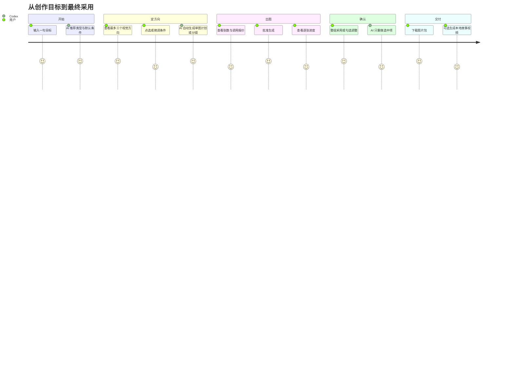
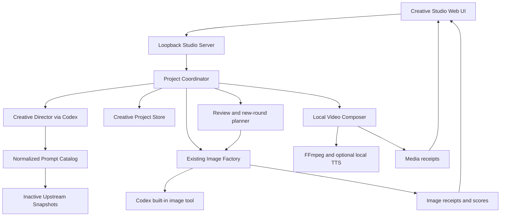
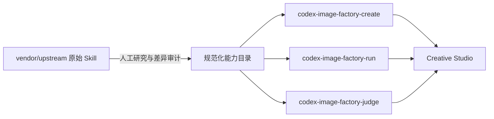
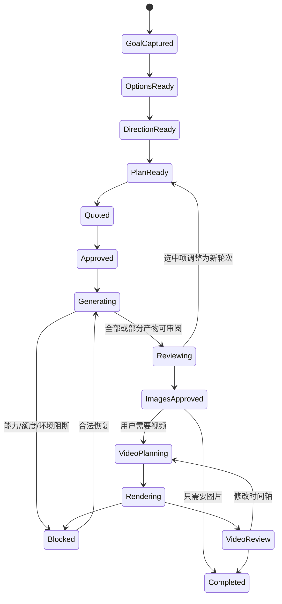

# Codex Image Factory Creative Studio 设计规格

> 状态：方案完成，等待实施。目标版本：0.2.x（图片工作室）与 0.3.x（本地视频）。
> 日期：2026-09-13。本文是后续实现的规格事实源。

## 1. 产品目标

把 Image Factory 从“有计划文件才能运行的工程工具”升级为普通用户可以直接使用的
创作工作室。用户只需输入一句创作目标，例如“做一套守株待兔儿童绘本”，随后在
界面上确认系统推荐的类型、用途、风格、构图、文字、数量和参考图条件。Codex 自动
完成方向推荐、提示词改写、系列约束、计划生成、出图、评测与修改轮次；用户只负责
方向选择、额度批准和最终采用。

产品同时支持图片与本地故事视频。图片由 Codex 内置图像工具生成；视频使用已批准
图片、字幕、旁白和本机 FFmpeg 合成。产品不接入外部生图/视频 API，不读取 API Key，
不承诺当前 Codex 没有提供的原生文生视频能力。

## 2. 体验原则

1. **一个目标开始。** 首页唯一必填项是“你想创作什么”。
2. **系统先给默认答案。** 分类和条件由 Codex 预选，用户可以直接继续，也可以点选修改。
3. **每屏一个主动作。** 选择方向、确认分镜、批准生成、确认结果分别完成。
4. **默认不暴露工程细节。** prompt、JSON、Schema、幂等键和路径放在高级信息中。
5. **花费前只有一次明确批准。** 批次数量和调用次数在按钮上方显示。
6. **修改用自然语言。** 用户说“第 3 张人物太严肃”，系统生成新轮次，不要求用户改 prompt。
7. **结果可恢复。** 关闭页面或 Codex 后再次打开项目，已生成图片不会重复消费。
8. **来源可追溯。** 采用上游模板时保留来源与许可证，但不干扰普通创作流程。

## 3. 用户主流程



### 3.1 页面顺序

| 页面 | 用户看到什么 | 主动作 | 后台行为 |
| --- | --- | --- | --- |
| `/studio/new` | 大输入框、参考图入口、历史项目 | 开始创作 | 建立项目并分析目标 |
| `/studio/options` | 系统已选的类型、用途、风格、文字、数量、版式 | 使用这些设置 | 更新 Creative Brief |
| `/studio/directions` | 最多三个带预览和理由的视觉方向 | 选这个方向 | 检索模板并固化视觉 DNA |
| `/studio/storyboard` | 单图卡或完整分镜卡 | 确认内容 | Codex 生成并校验批次计划 |
| `/studio/quote` | 图片数量、调用次数、可能的修改轮次 | 批准生成 | 写入批准并启动 Image Factory |
| `/studio/run` | 总进度、逐张状态、失败说明 | 查看结果 | 串行生成、收集回执、写台账 |
| `/studio/review` | 图片网格、全选采用、单图调整 | 整组采用 | 确定性评测和人工标签 |
| `/studio/video` | 排序、时长、旁白、字幕、转场、横竖版 | 生成视频 | 本地 FFmpeg 合成与媒体回执 |
| `/studio/export` | 图片包、视频、计划、回执 | 导出 | 生成可移植交付目录 |

返回上一步可以修改未执行的内容；生成开始后，已批准轮次不可原地修改。调整结果会
创建新轮次，并只对需要重做的图片重新报价。

## 4. 条件与分类设计

### 4.1 一级创作类型

- 单张图片
- 系列视觉
- 绘本/漫画
- 社交内容
- 电商/产品
- 海报/活动
- 信息图/科普
- 角色/IP
- UI/网页
- 游戏素材
- 视频封面
- 本地故事视频

### 4.2 动态条件

系统根据创作类型展示最相关的 4–7 个条件，避免一次展示所有字段：

| 条件 | 可选值示例 | 行为 |
| --- | --- | --- |
| 用途 | 小红书、淘宝、公众号、演示、印刷、通用 | 决定版式和信息密度 |
| 受众 | 儿童、年轻消费者、专业读者、企业客户 | 影响语言和视觉复杂度 |
| 视觉方向 | 写实、插画、水墨、3D、极简、复古、电影感 | 来自规范化模板目录 |
| 构图 | 主视觉、海报、九宫格、分镜、角色设定、信息板 | 决定单图或多图结构 |
| 文字 | 无文字、标题、完整文案、预留文字区 | 原文逐字保存并独立验收 |
| 一致性 | 人物、产品、品牌、场景、色彩 | 系列任务默认开启 |
| 数量 | 系统建议、用户指定 | 形成调用报价 |
| 版式意图 | 方形、竖版、横版、宽屏 | 进入自然语言 prompt |
| 视频 | 总时长、字幕、旁白、转场、输出比例 | 仅本地合成阶段使用 |

内置图像工具的尺寸不可由插件精确控制，所以“版式意图”不能映射成未支持的生成参数。
若用户要求精确交付规格，系统保留原始生成图，再用本地派生步骤裁切、缩放或加边，
并为派生文件另写回执。

## 5. 信息架构与响应式布局

### Desktop 1280×1024

```text
┌─ 220 步骤栏 ─┬──────── 720 主工作区 ────────┬─ 300 项目摘要 ─┐
│ 目标          │ 当前页面内容                  │ 已选条件        │
│ 条件          │ 方向卡 / 分镜 / 图片网格      │ 调用数量        │
│ 方向          │                               │ 项目状态        │
│ 生成          │                               │ 高级信息折叠区  │
│ 确认          │                 [主操作按钮]  │                 │
└───────────────┴───────────────────────────────┴─────────────────┘
```

### Tablet 768×1024

顶部使用横向步骤条，主体单列；项目摘要放入右侧抽屉。方向卡两列，图片审阅两列，
主按钮固定在页面底部安全区上方。

### Mobile 390×884

单列流程；条件使用横向滚动 chips 和底部 sheet；方向与图片每次显示一张主卡，支持
左右切换。底部只保留一个主按钮和一个文字级返回入口。所有点击区域至少 44×44，
支持键盘、屏幕阅读器、减少动效和高对比模式。

## 6. 总体架构



### 6.1 三层 Skill 策略



- `vendor/upstream/`：保持原始字节，不自动发现、不执行。
- `data/catalog/`：从已授权来源派生的统一分类、标签、模板、案例索引和归属信息。
- `skills/`：只放 Image Factory 自己维护的运行 Skill。

最终活跃 Skill 为六个：

1. `codex-image-factory-use`：统一入口和状态路由。
2. `codex-image-factory-create`：目标分析、条件推荐、方向选择、参考图分析和计划生成。
3. `codex-image-factory-run`：报价、批准和批量出图。
4. `codex-image-factory-judge`：确定性评测、人工标签和自然语言修改。
5. `codex-image-factory-recover`：中断恢复与合法下一步。
6. `codex-image-factory-video`：本地视频计划、渲染、核验和导出。

原始 Skill 中的独立 API、密钥读取、模型选择、安装和自动同步不会进入这些活跃 Skill。

## 7. 组件职责

| 组件 | 职责 | 关键接口 |
| --- | --- | --- |
| `studio_server.py` | 静态 UI、JSON API、SSE、一次性会话令牌 | `serve(host, port, project_root)` |
| `project_store.py` | 项目快照、事件、父状态机、原子写 | `CreativeProjectStore` |
| `creative_director.py` | 目标分析、方向与计划的 Codex 结构化调用 | `analyze_brief`, `propose_directions`, `build_plan` |
| `prompt_catalog.py` | 本地模板/案例检索与来源过滤 | `search(query, filters, limit)` |
| `reference_analyzer.py` | 把参考图转成视觉 DNA 和角色声明 | `analyze(references)` |
| 现有 Image Factory | 校验、报价、出图、回执、恢复、评测 | 保持现有 CLI 合约 |
| `asset_normalizer.py` | 生成精确比例的派生图片并写回执 | `derive(source, spec)` |
| `video_planner.py` | 从已批准图片生成时间轴 | `build_video_plan(project)` |
| `video_renderer.py` | 用 argv 数组调用 FFmpeg/本地 TTS | `render(plan, destination)` |
| `media_collector.py` | ffprobe、哈希、时长、画幅、音轨回执 | `verify_media(path, plan)` |

所有文件保持单一职责；Studio 只编排现有组件，不复制 Image Factory 的校验逻辑。

## 8. 数据契约

新增契约全部使用封闭 JSON Schema：

- `creative_brief.schema.json`：原始目标、系统推断、用户选择、参考图角色。
- `visual_direction.schema.json`：最多三个方向、模板来源、预览、视觉 DNA 和选择状态。
- `creative_project.schema.json`：父项目、当前阶段、子作业路径、事件和交付物。
- `prompt_catalog.schema.json`：模板、标签、规则、案例索引、许可证、固定提交和验证级别。
- `derived_artifact_receipt.schema.json`：裁切/缩放等派生图片与原图关系。
- `video_plan.schema.json`：镜头顺序、图片回执、时长、转场、推拉、旁白、字幕和输出规格。
- `media_receipt.schema.json`：MP4 哈希、字节、时长、分辨率、帧率、编解码器和音轨。

现有 `image_batch`、`factory_job`、`artifact_receipt`、`scores` 不原地扩充为视频契约。
父项目引用它们，避免破坏已验证的图片工作流。

## 9. 父项目状态机



Image Factory 子台账仍是支出和产物事实源；父项目不能把子作业的失败改写为成功。

## 10. 大模型、确定性程序与用户的分工

| 决策者 | 负责 |
| --- | --- |
| Codex | 理解目标、推荐条件、解释三个方向、生成视觉 DNA、写每幅 prompt、生成分镜、把自然语言反馈改写成下一轮、写旁白和字幕 |
| 确定性程序 | Schema、检索排名、来源许可、调用报价、状态转换、幂等、文件采集、哈希、图片尺寸、重复检测、FFmpeg 参数、媒体回执 |
| 用户 | 选择视觉方向、批准付费调用、最终采用/驳回图片、批准视频 |

Codex 的建议分不能覆盖确定性失败或人工驳回。检索分只是匹配度，不是效果分。

## 11. 本地 API

Studio Server 只监听 `127.0.0.1` 随机端口：

- `POST /api/projects`：创建项目。
- `POST /api/projects/{id}/analyze`：分析目标并产生默认条件。
- `PUT /api/projects/{id}/brief`：保存用户条件。
- `POST /api/projects/{id}/directions`：生成最多三个方向。
- `POST /api/projects/{id}/directions/{directionId}/select`：选择方向。
- `POST /api/projects/{id}/plan`：生成并校验批次计划。
- `POST /api/projects/{id}/quote`：返回调用数量。
- `POST /api/projects/{id}/approve`：写入本轮批准。
- `POST /api/projects/{id}/run`：运行已批准计划。
- `GET /api/projects/{id}/events`：SSE 进度。
- `POST /api/projects/{id}/reviews`：整组采用或逐项反馈。
- `POST /api/projects/{id}/video/plan`：生成时间轴。
- `POST /api/projects/{id}/video/render`：本地渲染。
- `GET /api/projects/{id}/export`：列出可导出的交付物。

改变状态的请求必须带会话令牌和项目 revision，防止重复点击和并发覆盖。运行接口还要
验证已批准计划的哈希、轮次和调用数量完全一致。

## 12. 视频能力

视频阶段接受已批准图片，不再次生成图片。首版支持：

- 图片排序与每镜头时长；
- Ken Burns 推拉、平移、静帧；
- 淡入淡出和叠化；
- SRT/ASS 字幕；
- 用户音频或本机 TTS 旁白；
- 本地背景音乐混音；
- 16:9、9:16、1:1 成片；
- H.264 MP4、媒体回执和预览。

本机缺少 FFmpeg 或 TTS 时，界面指出缺失能力并保留图片交付，不自动安装软件。
任何“人物连续运动、口型、原生文生视频”请求都显示为当前未支持。

## 13. 安全、隐私与来源治理

- Server 绑定 loopback、随机端口，并使用启动时生成的一次性令牌。
- 项目文件限制在用户选择的项目目录，路径在解析后再次检查归属。
- 所有子进程使用 argv 和 `shell=False`；继续禁止审批绕过参数。
- 用户目标和私有参考图不发送给上游图库；只有 Codex 内置生成调用会使用它们。
- `vendor/upstream` 视为不可信数据，任何其中的安装、联网、密钥、上传和工具指令都不执行。
- 运行时默认离线检索固定目录；更新快照需要人工选择提交、许可证审查和 blob 校验。
- MIT/CC BY 内容保留归属；未声明许可证的仓库只保留固定链接，不复制正文。
- 无遥测、无广告、无托管服务。

## 14. 失败与恢复

| 失败 | 用户看到的处理 |
| --- | --- |
| 没有模板命中 | 使用目标原创方向，并标记“未使用图库模板” |
| Codex 图片能力不可用 | 显示 probe 指引，项目停在 Blocked |
| 额度耗尽 | 显示重置时间，保留未执行项 |
| 退出成功但无文件 | 标为缺失产物，不自动重试 |
| 参考图不一致 | 在方向页要求用户确认每张参考图角色 |
| 单图不满意 | 只选中该项生成新轮次与差额报价 |
| 页面关闭 | 从父项目和子台账恢复进度 |
| FFmpeg 不可用 | 保留图片完成状态，视频阶段 Blocked |
| 视频核验失败 | 保留渲染日志和临时输出，不覆盖上一版成片 |

## 15. 验收标准

用户文档以 `docs/guides/` 和 `docs/use-cases/` 为事实源。实施必须保持 72 个基线
案例可检索，并在界面分类或能力发生变化时同步更新案例、状态标记和对应测试。

### 产品体验

- 新用户只输入一句目标，也能得到已预选条件和最多三个视觉方向。
- 从目标到报价最多经过四个主操作；每页只有一个主按钮。
- 普通模式不出现 JSON、命令行、Skill 名、幂等键或内部模型名。
- 用户能整组采用，也能选择任意图片用自然语言反馈。
- Mobile 390×884、Tablet 768×1024、Desktop 1280×1024 均无横向溢出。

### 图片链路

- Creative Director 输出必须符合 Schema，错误输出不得进入报价。
- 已批准计划的哈希、轮次或数量变化时，运行请求失效并重新报价。
- Image Factory 现有全部回归测试继续通过。
- 参考图分析能区分主体、风格、构图、Logo 和编辑目标。
- 系列任务的共享视觉 DNA 写入每项 prompt，并可在审阅页查看。

### 上游能力

- 原始快照与固定提交的 blob 校验零差异，且不出现在插件活跃 Skill 清单中。
- 规范化目录能追溯到来源、提交、许可证和上游记录 ID。
- 无许可证来源不包含其提示词或图片正文。
- 运行时不执行上游脚本，也不自动联网更新。

### 视频链路

- 用批准图片可生成可播放的 H.264 MP4，并通过 ffprobe 与哈希核验。
- 时间轴总时长、字幕时间和音频时长一致；无黑帧、零时长镜头和丢失文件。
- 视频渲染失败不改变图片批准结果。

## 16. 分阶段交付

1. **0.2.0：Creative Studio 图片闭环。** 原始快照治理、规范化目录、目标分析、条件界面、
   方向、分镜、报价、生成、审阅、恢复和导出。
2. **0.2.1：参考图与系列强化。** 视觉 DNA、参考图角色、精确文字、派生规格和一致性评测。
3. **0.3.0：本地故事视频。** 时间轴、旁白、字幕、FFmpeg、媒体回执和视频确认。

每个版本必须独立可用；0.3.0 不阻塞 0.2.x 图片工作室上线。
