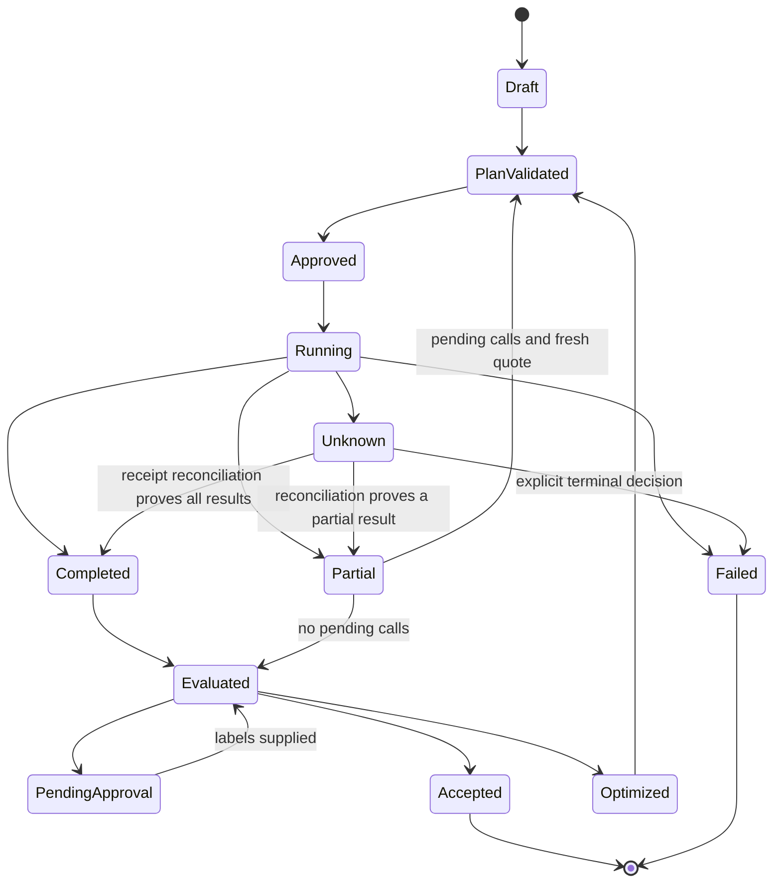

# Codex Image Factory 0.1.2 Production Hardening Design Specification

> Status: approved for implementation planning; not implemented. 2026-09-14.

## Goal

Treat every operation that can spend image-generation allowance as an auditable,
crash-safe transaction. Preserve the Codex conversation as the product surface,
while making approval, execution, receipt persistence, evaluation, recovery, and
release evidence agree end to end.

This specification extends the 0.1.0 compatibility baseline in
`docs/superpowers/specs/2026-09-12-codex-image-factory-plugin-design.md`. It does
not rewrite or retroactively relabel that baseline.

## Product boundary

- The user describes an image-creation goal in normal language.
- Codex proposes up to three directions and recommends one.
- Every round that may spend allowance requires a fresh, explicit user approval.
- Results are numbered and can be accepted as a group, accepted selectively, or
  sent to a new round with exact user-authored corrections.
- The CLI, schemas, ledger, lock, receipts, and tests are implementation details;
  no separate graphical interface is added.
- The repository remains image-only. Video generation, editing, composition, and
  publication remain outside this plugin.
- The plugin continues to use the built-in Codex image capability and existing
  account authentication. It adds no external generation API and reads no
  credential material.

## Safety invariants

1. A generation round cannot start without an approval record bound to the exact
   validated plan hash, round number, and remaining image count.
2. A changed prompt, reference-image byte sequence, item set, policy, round, or
   allowance count changes the validated plan hash and invalidates prior approval.
3. A job has one cross-process mutation lock. A second writer fails before it can
   reserve an item or invoke Codex.
4. An item is atomically marked `Attempting` with a unique `attempt_id` before the
   external generation process starts.
5. The plugin never automatically invokes the same idempotency key after an
   ambiguous interruption. Ambiguous work becomes `Unknown` and requires an
   explicit user decision.
6. A generated artifact becomes recoverably complete only after a schema-valid,
   hash-verifying per-item receipt has been atomically persisted.
7. The aggregate receipt manifest is a rebuildable projection of per-item
   receipts, not the source of truth.
8. A plan requiring human labels cannot receive `pass` while any required item is
   unlabeled.
9. Model-authored assessment remains advisory. Deterministic gates and explicit
   human labels retain the precedence defined by the existing specification.
10. No recovery path installs software, bypasses Codex approvals or sandboxing,
    retries automatically, or infers that an external call did not happen.
11. Persisted approval and execution evidence contains no raw credential, cookie,
    authorization header, or asserted user identity.
12. Every persistent contract is closed JSON Schema and is enforced by the same
    schema-driven checker used by runtime code.
13. A production-ready verdict requires a paid canary against the exact release
    candidate that will be tagged without further runtime-code changes. Without
    new authorization, the truthful state remains release candidate with
    `paid_canary = NOT_RUN`.

## Transaction flow

```mermaid
flowchart LR
    A[User goal] --> B[Directions and recommendation]
    B --> C[Round plan and quote]
    C --> D[Explicit approval]
    D --> E[Bind plan hash and approval record]
    E --> F[Acquire job lock]
    F --> G[Record Attempting and attempt id]
    G --> H[Invoke Codex once]
    H --> I[Publish image atomically]
    I --> J[Persist per-item receipt atomically]
    J --> K[Record Generated]
    K --> L[Rebuild manifest]
    L --> M[Deterministic evaluation]
    M --> N[Human labels]
    N -->|accepted| O[Accepted]
    N -->|rework| P[Optimized next round]
    P --> C
```



## Contract versions and compatibility

### Image plan 1.1.0

`schemas/image_batch.schema.json` advances to `1.1.0`.

- `limits.require_approval_before_run` is required and has `const: true`.
- `judge_policy.require_human_labels` is required and has `const: true`.
- Existing plan controls for size, quality, count, background, and model remain
  forbidden.
- A deterministic migration maps a 1.0.0 plan to 1.1.0 by enabling both safety
  requirements. Migration emits a visible note; it never silently weakens policy.

### Factory job 1.1.0

`schemas/factory_job.schema.json` advances to `1.1.0`.

- Batch states are `Draft`, `PlanValidated`, `Approved`, `Running`, `Completed`,
  `Partial`, `Unknown`, `Evaluated`, `PendingApproval`, `Optimized`, `Accepted`,
  and `Failed`.
- Item states are `Pending`, `Attempting`, `Generated`, `Failed`, `Skipped`, and
  `Unknown`.
- `batch` stores the current `batch_id`, `round`, `plan_sha256`, and image count.
- `approval` stores `current` plus append-only `history` records.
- `evaluation` stores the scores hash, decision, and evaluation time.
- `optimization` stores the next-plan hash, next round, and creation time.
- Each item stores its idempotency key, attempt count, current `attempt_id`,
  attempt start time, receipt id, and error category.
- A deterministic migration converts a 1.0.0 job to 1.1.0 without changing its
  observed item outcomes. Existing `approval: null` becomes an empty approval
  history, not proof of historical approval.

### Artifact receipt 1.0.0

The artifact receipt schema remains at 1.0.0. Its existing `idempotency_key`,
artifact hash, dimensions, byte count, session id, and call id are sufficient to
reconcile a persisted result. The pre-call `attempt_id` belongs to the ledger and
does not alter historical receipt compatibility.

## Approval evidence

An approval record has this closed shape:

```json
{
  "plan_sha256": "64 lowercase hexadecimal characters",
  "round": 1,
  "image_count": 6,
  "source": "run_approve_flag",
  "approved_at": "2026-09-14T12:00:00Z"
}
```

The record proves that the CLI received its explicit approval flag for a specific
transaction; it is not a cryptographic identity signature. The plugin does not
claim to authenticate the human speaker or to prove which interface supplied it.
`run --approve` creates this record only after validating the current plan and
before entering `Running`. A later run must either match the same plan and have
zero pending calls, or obtain a new approval for the current remaining-call
quote.

## State model



Additional rules:

- Ordinary `run` cannot enter from `Running`, `Completed`, `Evaluated`,
  `PendingApproval`, `Unknown`, `Accepted`, or `Failed`.
- `Partial` can return to `PlanValidated` only when it has unattempted items, no
  `Unknown` item, no active usage limit, and the remaining-call count is quoted
  and freshly approved.
- A stale `Attempting` item is never changed to `Pending`. Receipt reconciliation
  changes it to `Generated` when evidence is complete; otherwise it becomes
  `Unknown`.
- A timeout, interrupted subprocess, or success-without-durable-receipt is
  ambiguous and becomes `Unknown`. A definite producer rejection, quota event, or
  deterministic collection failure becomes `Failed`; neither state is retried
  automatically.
- `evaluate` performs `Completed/Partial -> Evaluated`, then maps `pass` to
  `Accepted`, `pending_approval` to `PendingApproval`, and leaves a deterministic
  or human rejection in `Evaluated` for explicit optimization.
- `optimize` requires the job, scores, and current plan to agree before performing
  `Evaluated -> Optimized`.

## Receipt durability and reconciliation

Per-item receipts live in a deterministic directory adjacent to the ledger. The
filename is the item's idempotency key plus `.json`. Writes use a same-directory
temporary file, flush, `fsync`, and atomic replace. The manifest at
`<job>.receipts.json` is rebuilt atomically from validated per-item receipts.

Recovery follows this evidence order:

1. Acquire the job mutation lock.
2. Load and migrate the ledger in memory.
3. Validate every per-item receipt against the receipt schema.
4. Recompute artifact hash, byte count, and dimensions from disk.
5. Promote a matching `Attempting` or `Unknown` item to `Generated`.
6. Mark an unmatched stale `Attempting` item `Unknown`.
7. Rebuild the aggregate manifest from verified receipts.
8. Derive `Completed`, `Partial`, or `Unknown` without making a generation call.

## Crash matrix

| Crash point | Durable evidence | Recovery result | Automatic generation |
| --- | --- | --- | --- |
| Before `Attempting` write | Item remains `Pending` | Safe to include in a newly approved run | Allowed after approval |
| After `Attempting`, before or during Codex | Attempt may have reached Codex | Item becomes `Unknown` without a receipt | Forbidden |
| After image publication, before receipt | Artifact exists without durable receipt | Item becomes `Unknown` | Forbidden |
| After receipt, before ledger completion | Verified receipt exists | Reconcile to `Generated` | Forbidden |
| After ledger completion, before manifest | Receipt and ledger agree | Rebuild manifest | Forbidden |
| After manifest | All durable records agree | Continue to evaluation | Forbidden |

## Cross-process locking

- The lock is derived from the job path and held by an open file descriptor.
- Unix uses `fcntl.flock`; Windows uses `msvcrt.locking`.
- Lock acquisition is non-blocking by default and reports
  `job_already_running`.
- The lock covers plan binding, approval recording, item reservation, generation,
  receipt persistence, ledger completion, and final state transition.
- Process exit releases the operating-system lock. A leftover lock file is not by
  itself treated as an active owner.
- Ledger atomic replace remains necessary for crash integrity; the lock adds
  writer serialization and does not replace atomic persistence.

## Conversation behavior

The four active Skills share one conversation contract:

1. Give a recommendation before asking the user to choose.
2. Show the exact round, image count, and remaining generation-call count.
3. Accept explicit approval only for the displayed plan and round.
4. Never carry approval from an earlier round into a changed plan.
5. Present numbered results and preserve the user's correction words.
6. If recovery finds `Unknown`, explain the ambiguity and do not suggest a retry
   as a diagnostic action.
7. Do not expose file locking, receipt migration, or schemas unless the user asks
   for technical detail.

## Release gates

Production readiness requires all of the following:

- Unit and integration tests pass on Linux, macOS, and Windows with supported
  Python versions.
- A real two-process test proves one winning process and one Codex invocation per
  planned item.
- Crash injection covers every row in the crash matrix.
- Old 1.0.0 plans and jobs migrate deterministically and validate as 1.1.0.
- The full source suite, installed-cache suite, distribution validator, compile
  check, secret scan, link checks, and upstream snapshot checks pass.
- The current Codex CLI has no `plugin validate` command; production evidence must
  not claim that command ran. Fresh marketplace resolution, installation, Skill
  discovery, and CLI reachability are the consumer-facing plugin checks.
- Source, tag, upstream branch, remote branch, and installed cache resolve to the
  same released commit with a clean tree.
- A fresh Codex conversation stops before generation, displays a quote, accepts a
  new-round approval, and returns to human result confirmation.
- A paid canary requires separate authorization. When authorized, it uses the
  smallest useful batch and records real receipts without inferring a model.
  Without it, 0.1.2 may be published as a release candidate but is not labeled
  production-ready.

## Non-goals

- Exactly-once guarantees from the external Codex service. The plugin instead
  guarantees no automatic retry after ambiguous execution.
- A daemon, database service, remote coordinator, or distributed lock manager.
- A separate graphical interface.
- Automatic publishing or social-platform delivery.
- Video production or orchestration.
- Storing raw conversational transcripts in the ledger.
