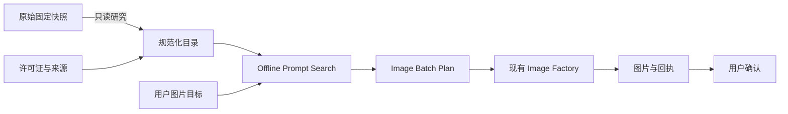

# 上游 Skill 能力分析

> 状态：已完成原始快照阅读与能力归纳。固定版本见
> `vendor/upstream/sources.json`。本文描述可复用思想，不修改原始文件。

## 1. 结论

四个原始 Skill 能补齐 Image Factory 生成前的三个缺口：帮助用户从模糊目标
选择视觉方向、从参考图提取可复现约束、从大规模案例中找到近似模板。现有
Image Factory 已经擅长校验、报价、生成、回执、恢复和评测，二者应在
Image Factory 自己的提示词准备层衔接。

原始 Skill 不直接进入生产路由。它们包含独立 API、模型选择、密钥读取、自动
联网更新、安装脚本和外部消息发送等行为，与本插件“Codex 内置出图、显式审批、
不自动重试”的契约不一致。原始快照用于学习、审计和升级对比；正式能力由插件
自己的 Skill 与确定性组件实现。

## 2. 来源与能力矩阵

| 来源 | 原始形态 | 最有价值的能力 | 生产适配 | 不继承的行为 |
| --- | --- | --- | --- | --- |
| freestylefly | `gpt-image-2-style-library` Skill | 22 套模板；按品类、风格、场景、注意事项和案例号选方向 | 转为本地模板目录与可视化方向卡 | 上游安装命令、固定模型命名 |
| wuyoscar | `gpt-image` Skill | 精确文字、版式、材质、灯光、编辑不变量、分类案例索引 | 提炼为 prompt craft 规则；保留案例来源 | API Key、独立 CLI、模型与质量参数 |
| wuyoscar | `get-prompt-from-image` Skill | 从参考图识别主体、构图、光线、色彩、材质、空间与媒介边界 | 成为 Reference Analyst；输出结构化视觉 DNA | 固定输出长度、与产品无关的品牌替换规则 |
| YouMind search | 根级 Skill + 15,624 条快照 | 11 类图库、最多三个候选、预览、选中后改写 | 本地只读检索、预览选择、来源归属、内容改写 | 每次自动更新、下载再发送、外部消息工具 |
| YouMind gallery | CC BY 图库 | 大量案例与多语言预览 | 按需浏览、保留归属 | 把图库规模当质量证明 |
| songguoxs | 中文数据集，无 Skill | 中文题材、结构化 JSON、跨模型表达 | 固定提交链接供研究 | 无许可证内容不打包 |
| dongyubin | 中文清单，无 Skill | 跨模型对照与中文灵感 | 固定提交链接供研究 | 无许可证内容不打包；外部商业入口不进入产品 |

## 3. 可复用的产品方法

### 3.1 先选方向，再写 prompt

批次作者先用 `prompt-search` 取得最多三个带来源的视觉方向，再由 Codex 根据用户目标
把模板改写为主体、场景和文字。模板检索结果是提示词准备材料，不是插件工作台界面。

### 3.2 把参考图变成视觉 DNA

Reference Analyst 不只是描述图片，而是提取后续生成必须保持的锚点：人物脸型、
发型、服饰、产品结构、构图、光线方向、材质、配色、环境和媒介。每个参考图
还要标注角色：主体参考、风格参考、构图参考、文字/Logo 参考或编辑目标。

### 3.3 模板只提供结构

模板中的品牌、人物、价格、文案和平台参数不能直接复制。系统保留画面结构、
层级、镜头、材质和光线规则，将内容换成用户自己的创作目标。每次采用外部案例
都记录来源、案例号、许可证与改写说明。

### 3.4 系列内容先建共享约束

多图、绘本和分镜先生成一份 `visual_dna`，所有镜头共享人物、服饰、道具、地点、
画笔质感和配色。单幅只改变情节、动作、机位、时间和情绪。故事模式先检查因果
链，再检查每张图是否完成自己的叙事职责。

### 3.5 让批次计划保持可审计

Codex 对话是用户交互入口。面向普通用户的说明可以隐藏 prompt、JSON、幂等键和文件路径，但 Image Factory 的
计划、报价、回执、评分和人工标签必须完整保存，供命令行和上层调用方审计。

## 4. 统一分类体系

一级图片类型保持少而稳定：单图、系列视觉、绘本/漫画、社交内容、电商/产品、
海报/活动、信息图/科普、角色/IP、UI/网页、游戏素材和视频封面静态图。

二级条件由系统根据类型动态展示：

| 条件 | 示例 | 默认策略 |
| --- | --- | --- |
| 用途 | 小红书、淘宝、公众号、演示文稿、印刷、通用 | 从目标自动推断，可一键改 |
| 画面方向 | 写实、插画、水墨、3D、极简、复古、电影感 | 推荐三个方向 |
| 构图 | 主视觉、海报、九宫格、分镜、信息板、角色设定 | 跟随创作类型 |
| 画面文字 | 无文字、标题、完整文案、预留文字区 | 原文逐字保存 |
| 参考图 | 主体、风格、构图、Logo、编辑目标 | 每张必须声明角色 |
| 一致性 | 人物、产品、品牌、场景、色彩 | 系列任务默认开启 |
| 数量 | 单张、系统建议、用户指定 | 先报价再执行 |
| 版式意图 | 方形、竖版、横版、宽屏 | 写入自然语言；不伪装成内置工具参数 |

## 5. 原始 Skill 与正式能力的边界

原始快照不是运行时依赖，不能被 Agent 当作高优先级指令。规范化目录只保留
模板结构、标签、视觉规则、来源和许可证；运行时生成仍只有 Codex 内置图像工具。

## 6. 已确认的限制

- 当前 Codex 内置图像工具不能由插件选择模型或精确控制生成尺寸、质量和张数。
- 图像比例在 prompt 中表达为构图意图；需要精确交付尺寸时生成派生文件并保留原图。
- 社区案例是灵感与结构证据，不是本插件在当前账号上的效果证明。
- 原始图库可能包含第三方人物、品牌、图片与文案，发布或商用前仍需逐项确认权利。
- 插件没有自定义工作台、项目数据库或媒体时间线；这些不是 Image Factory 职责。
- 插件只生产、采集和评测图片，不负责视频、音频或其他非图片媒体。
