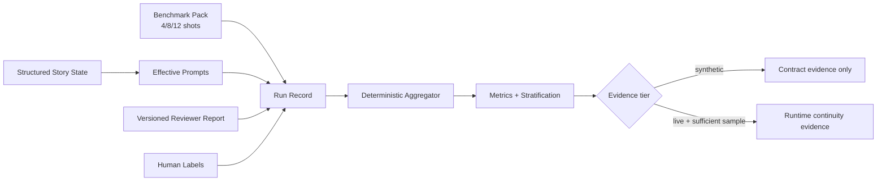

## Context

Image Factory 当前以 `image_batch` 驱动计划验证和有效提示词编译，以不可变回执绑定生成结果，以 `scores`、校准报告和可重建 contact sheet 承载评审证据。现有 `consistency_profile` 已有实体 fixed traits、allowed variations 和参考图，但没有跨镜头状态继承；评审输入仍是调用方构造的 advisory JSON，没有统一的评审器身份与版本合同；连续性指标也没有独立基准运行模型。

仓库只使用 Python 标准库，合同通过轻量 JSON Schema 校验器和显式迁移保持兼容。受管技能不可编辑，插件本地技能和 OpenSpec 是可修改边界。`.codegraph` 当前不存在，本设计依据当前源码、测试与已归档规格建立。

## Goals / Non-Goals

**Goals:**

- 在不引入外部运行依赖的前提下，先建立 P0 的基准、故事状态和评审器合同。
- 所有新增证据都可追溯到版本、输入和人工标签，并可区分 `synthetic` 与 `live`。
- 保留现有计划的行为；只有显式声明新字段的计划才进入故事状态编译。
- 让后续 aHash 组合、校准漂移、审片 UI 和真实验收可以在同一事实源上增量落地。

**Non-Goals:**

- 第一阶段不绑定特定 embedding/OCR/grounding 模型，不安装推理依赖。
- 不把视觉评审器结论升级为确定性失败，不自动调整阈值或自动开启新一轮。
- 不用合成 PNG 冒充真实模型人物连续性验收。
- 不在本变更中修改受管 Baoyu 技能或扩大内置图像工具的参数面。

## Decisions

### 1. 一个 OpenSpec 变更、三个可独立发布的阶段

本需求的八项工作共享同一组合同和证据边界，因此使用一个 change 作为事实源，按阶段交付：

1. **Foundation**：基准合同/聚合、结构化故事状态、版本化评审器接口。
2. **Evidence UX**：多哈希、分层校准与漂移、人工审片工作区。
3. **Runtime acceptance**：跨宿主/模型、付费生成和故障注入矩阵。

每个阶段必须独立通过合同迁移、全量测试与分发校验；未完成任务继续留在 change 中。替代方案是拆成多个 OpenSpec changes，但会重复定义同一状态与评审证据，容易产生事实源漂移。

### 2. 故事状态使用线性继承和封闭路径

`consistency_profile.story_state` 采用四类数据：

- `permanent_locks`: 全故事不变的 `{path, value}`。
- `scenes`: 场次 id 及其 `locks`。
- `variables`: 允许变化的 `{path, initial_value}`。
- 条目级 `scene_id` 和 `state_transitions`: `{path, from, to}`。

状态路径采用点分隔标识符（例如 `character.student.pose`），值在第一阶段限定为非空字符串。计划按 items 顺序线性解析；未声明变量继承前一镜头，转换的 `from` 必须等于当前值。永久锁定不能与场次锁定或变量重叠；不同场次可以锁定同一路径为不同值。

有效提示词使用路径排序后的固定章节输出，确保相同输入产生字节一致结果。相较自由 JSON Patch，这个模型更窄，但容易验证、迁移和审计，也不会允许删除或数组下标带来的隐式语义。

### 3. 新合同独立版本，旧计划按原语义迁移

- `image_batch` 升级并新增可选 story-state 字段；旧版本迁移只补空值，不编造锁定或转换。
- 新增 `continuity_benchmark`、`continuity_benchmark_report` 和 `reviewer_report` schema。
- 评审器适配器先把单份标准报告无损转换为现有 advisory 输入；多评审器聚合在第二阶段加入，但报告原件从第一阶段起可持久化。
- benchmark 聚合只消费显式运行记录和人工标签，不反向调用模型或修改 job ledger。

### 4. 基准运行与生产运行共用证据，但不共用结论

基准 pack 描述镜头覆盖与真值维度，run 描述实际模型/供应商/策略和人工结果，report 负责聚合：

一次通过率的分母是 run；人物漂移率和元素丢失率的分母分别只包含有对应人工标签的镜头；未标注数量单列。成本、耗时不可观察时为 `null`。分层样本少于 policy 的 `minimum_sample_size` 时固定为 `insufficient_sample`。

### 5. 评审器报告与决定解耦

标准报告包含 reviewer id/version/capabilities、batch/round、每项 findings、置信度、证据文本和可选归一化区域。适配器只做 schema 校验和字段映射，不执行模型推理。低置信度发现标为 uncertain；人工标签和确定性门继续由 evaluator 按现有权威排序处理。

### 6. 后续证据面保持派生、可重建

contact sheet 的升级继续复用已核验回执，不复制原图；局部区域用坐标和 CSS 展示，不创建未经回执绑定的新图片真相源。390px 布局在静态 HTML/CSS 测试和浏览器验收中分别验证。

## Risks / Trade-offs

- [点路径过窄，难以表达复杂对象] → 第一阶段限定字符串叶子值；需要复合结构时通过多个稳定路径表达，未来再以新 schema 版本扩展。
- [items 顺序成为状态语义] → schema 和文档明确顺序即镜头顺序，计划哈希继续绑定完整规范化文档。
- [评审器给出高精度假象] → 强制版本、置信度、证据和样本充足性；所有信号保持 advisory。
- [基准数据只有合同没有真实图片] → 报告强制 evidence tier，第一阶段明确 `synthetic`，真实运行任务不得提前勾选。
- [单一 change 跨多个发布周期] → tasks 按阶段分组，每个发布只勾选实际完成项，并在最终 runtime acceptance 后才归档。
- [兼容迁移改变旧计划哈希] → 旧文档迁移只在显式读取/升级时产生新 schema 版本；未迁移的 1.4.0 计划继续按原始规范化规则工作。

## Migration Plan

1. 先归档两个已完成变更并同步主规格。
2. 新增 schema 和失败测试，再实现 story-state 解析、有效提示词编译、评审器适配和基准聚合。
3. 为旧 `image_batch` 增加无发明数据的迁移，运行全量回归与分发检查。
4. 以 minor 版本发布 Foundation；若新字段造成问题，可回滚到上一插件版本，旧计划合同不受影响。
5. 后续阶段分别扩展质量证据、审片页和 runtime matrix；真实运行未完成时保留 `NOT_RUN`。

## Open Questions

- 首批 `live` 基准使用哪些具体模型/供应商，由运行时可用能力和费用批准决定；不影响合同、聚合器或第一阶段任务。
- 多评审器第二阶段采用中位数、保守下界还是只展示分歧，将由首批人工标注数据决定；第一阶段保留原始报告，不预先丢失信息。
