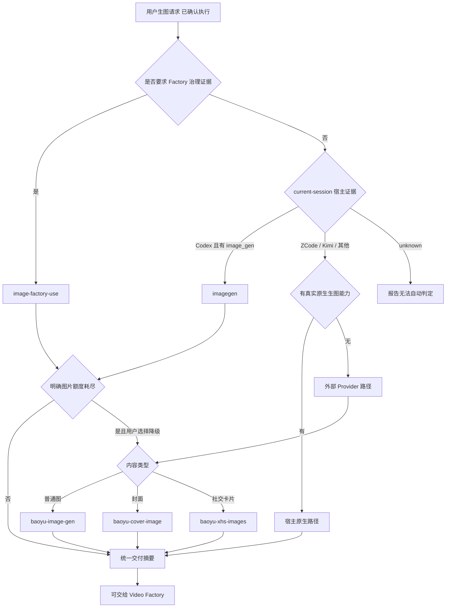

# 图片能力 Harness

## When to use

用本技能决定“由谁执行”，而不是在这里生成图片。用户确认要生图后，先识别当前会话
宿主与实际工具能力，再选择入口：

| 用户目标 | 交给 |
| --- | --- |
| Codex 中已确认的直接生图或编辑，且当前会话暴露 `image_gen` | 优先 **`imagegen`** |
| Codex 内置路径有明确额度耗尽证据，用户选择普通图降级 | **`baoyu-image-gen`** |
| Codex 内置路径有明确额度耗尽证据，用户选择封面降级 | **`baoyu-cover-image`** |
| Codex 内置路径有明确额度耗尽证据，用户选择社交卡片降级 | **`baoyu-xhs-images`** |
| 需要计划校验、报价、批准、回执、评测、优化轮次或恢复 | **`image-factory-use`** |
| 在 Factory 治理路径内，需要独立分维度评审或收敛/回归/停滞证据 | **`image-factory-review`** |

这些入口由宿主或插件提供。只按技能名称交接，不复制其正文，也不在 Harness 中重写
Provider、风格矩阵、确认步骤或执行规则。

## Workflow

1. 从当前请求识别两组信号：
   - **直接创作**：生图、封面、卡片、参考图、风格、比例或指定后端。
   - **Factory 治理**：计划、预算、批准、回执、确定性评测、优化轮次或中断恢复。
2. 用户确认执行后，读取[能力地图](references/capability-map.md)的宿主识别规则。Codex
   且当前会话暴露 `image_gen` 时，直接创作必须优先交给 **`imagegen`**；不得先请求
   Provider 密钥。
3. 只有取得结构化 `quota_exceeded` 图片配额证据后，才可以提出 Baoyu 降级。普通失败、
   工具缺失、authentication、network、timeout 或 unknown 都停在原路径并如实报告。
4. 两组信号同时存在时，读取
   [能力地图](references/capability-map.md) 的“混合请求”部分。当前 **no execution adapter**
   可以把 Baoyu 的直接执行自动变成 Factory 执行；必须向用户说明差异并请其 **choose**：
   直接创作路径，或带 approval / receipt / evaluation 的治理路径。
5. ZCode、Kimi 或其他宿主只使用当前会话真实暴露的原生图片能力；没有可验证原生能力时，
   才把 Baoyu 作为外部 Provider 路径。这不是 Codex 的额度降级语义。
6. 所选技能完成后，按能力地图中的统一交付契约报告真实证据。

## Factory branch

只有选择 **`image-factory-use`** 后才应用以下约束：

- Factory CLI 通过本地 Codex CLI 执行，使用对应账户的图片配额；模型、size 与 quality
  由该执行路径的真实能力决定，不把 Baoyu Provider 能力描述成 Factory 能力。
- 执行通道是 `<插件根>/bin/image-factory`；先 `probe`，再按路由技能执行
  validate-plan、quote、run、evaluate、summarize、optimize、recover 或 status。
- `--generation-dir` 保存计划、台账与执行中间状态，`--destination` 保存正式产物；两者分离。
- 长任务使用 `status --watch` 只读观察 attempt 事件；不得用重复 `run` 充当进度查询。
- timeout/interrupt 后先执行 `recover`。它只按原 attempt 的 session 归属查找晚到产物，不触发新生成。
- 容量预检失败时原样报告 required/available bytes，不自动清理磁盘，也不绕过门禁。
- JSON 输出、回执和台账是事实来源；叙述不得覆盖机器证据。
- 系列批次使用封闭评审维度，并把比例、感知哈希、故事板、provenance 与人工校准
  作为独立证据；`summarize` 只能从已核验回执重建派生汇总，不能触发生成。
- 台账仅在 `error_category=quota_exceeded` 且 `usage_limit.limit_id=image_gen` 时证明图片
  配额耗尽；只有这类证据允许提出 Baoyu 降级。

## Delivery

所有路径都输出统一摘要，但只填写实际获得的证据：宿主判定、所选技能、执行后端、
输出路径、prompt 记录、参考输入、治理证据和未验证项。直接 Baoyu 路径的 Factory approval、
receipt 和 evaluation 应标记为 `not_applicable`，不得事后伪造。

若下一步是视频制作，只交付摘要与图片资产；本 Harness 不执行视频。

## Never do

- 不直接修改、裁剪或复制三个外部 Baoyu 技能的正文、脚本和引用资料。
- 不根据 `imagegen` 技能是否已安装、插件目录或文件路径推断当前宿主。
- 不在 Codex 内置额度尚未明确耗尽时，引导用户配置 Baoyu 或其他 Provider 密钥。
- 不要求用户把密钥粘贴到对话；只允许用户选择后在本机按对应技能说明配置。
- 不把直接 Baoyu 产物描述成经过 Factory 计划、批准、回执或评测。
- 不把一个路径的后端、重试、确认或费用规则套到另一个路径。
- 不替用户批准付费执行，也不把旧批准沿用到变化后的计划、prompt、参考图或数量。
- 不因为最终需要视频，就在 Image Factory 中声称已经完成视频生成、剪辑或合成。
