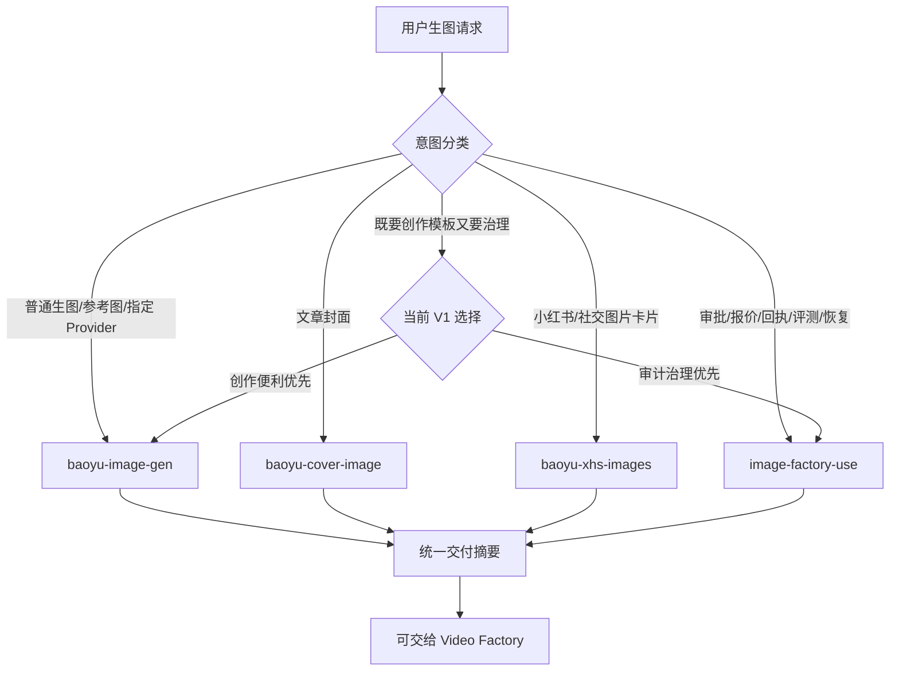

# 图片能力 Harness

## When to use

用本技能决定“由谁执行”，而不是在这里生成图片。它只负责四个入口的能力仲裁：

| 用户目标 | 交给 |
| --- | --- |
| 普通生图、参考图生成、指定后端或批量 prompt 文件 | **`baoyu-image-gen`** |
| 文章封面、头图、Cover | **`baoyu-cover-image`** |
| 小红书、微信图片卡片、社交信息图系列 | **`baoyu-xhs-images`** |
| 需要计划校验、报价、批准、回执、评测、优化轮次或恢复 | **`image-factory-use`** |

四个入口已经随插件提供。只按技能名称交接，不复制其正文，也不在 Harness 中重写
Provider、风格矩阵、确认步骤或执行规则。

## Workflow

1. 从当前请求识别两组信号：
   - **直接创作**：生图、封面、卡片、参考图、风格、比例或指定后端。
   - **Factory 治理**：计划、预算、批准、回执、确定性评测、优化轮次或中断恢复。
2. 只有一组信号时，按上表交给最具体的技能并停止；不要先运行另一个技能。
3. 两组信号同时存在时，读取
   [能力地图](references/capability-map.md) 的“混合请求”部分。当前 **no execution adapter**
   可以把 Baoyu 的直接执行自动变成 Factory 执行；必须向用户说明差异并请其 **choose**：
   直接创作路径，或带 approval / receipt / evaluation 的治理路径。
4. 只有在请求含糊、跨路径或需要交给 Video Factory 时才读取能力地图；普通请求不加载它。
5. 所选技能完成后，按能力地图中的统一交付契约报告真实证据。

## Factory branch

只有选择 **`image-factory-use`** 后才应用以下约束：

- Factory CLI 通过本地 Codex CLI 执行，使用对应账户的图片配额；模型、size 与 quality
  由该执行路径的真实能力决定，不把 Baoyu Provider 能力描述成 Factory 能力。
- 执行通道是 `<插件根>/bin/image-factory`；先 `probe`，再按路由技能执行
  validate-plan、quote、run、evaluate、optimize、recover 或 status。
- `--generation-dir` 保存计划、台账与执行中间状态，`--destination` 保存正式产物；两者分离。
- JSON 输出、回执和台账是事实来源；叙述不得覆盖机器证据。

## Delivery

所有路径都输出统一摘要，但只填写实际获得的证据：所选技能、执行后端、输出路径、
prompt 记录、参考输入、治理证据和未验证项。直接 Baoyu 路径的 Factory approval、
receipt 和 evaluation 应标记为 `not_applicable`，不得事后伪造。

若下一步是视频制作，只交付摘要与图片资产；本 Harness 不执行视频。

## Never do

- 不直接修改、裁剪或复制三个外部 Baoyu 技能的正文、脚本和引用资料。
- 不把直接 Baoyu 产物描述成经过 Factory 计划、批准、回执或评测。
- 不把一个路径的后端、重试、确认或费用规则套到另一个路径。
- 不替用户批准付费执行，也不把旧批准沿用到变化后的计划、prompt、参考图或数量。
- 不因为最终需要视频，就在 Image Factory 中声称已经完成视频生成、剪辑或合成。
